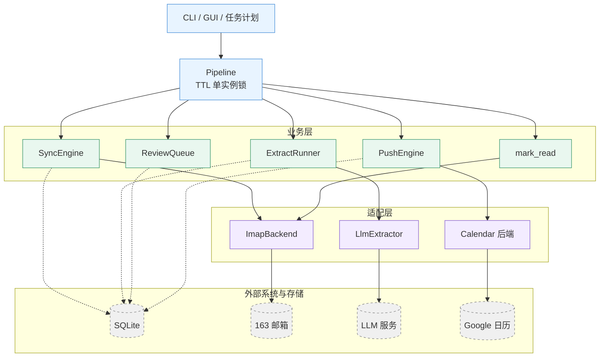
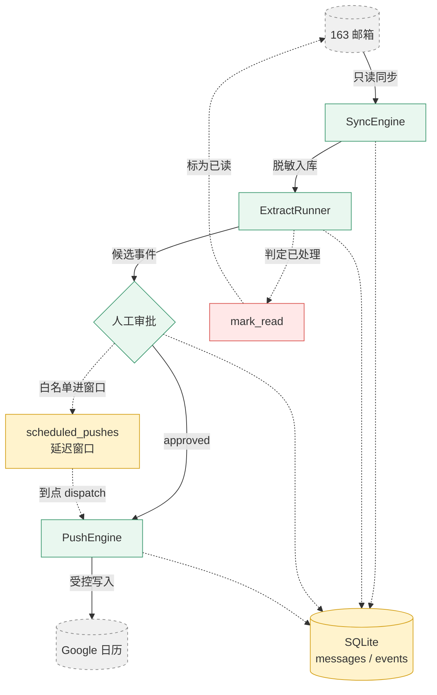
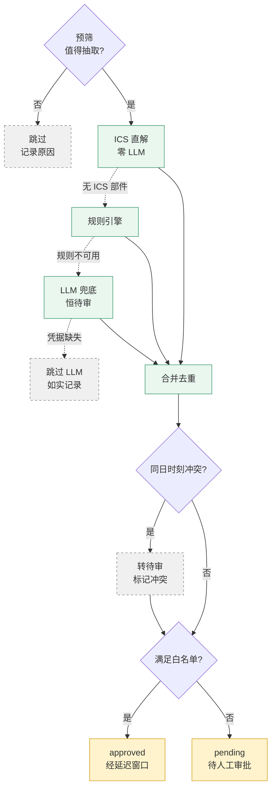
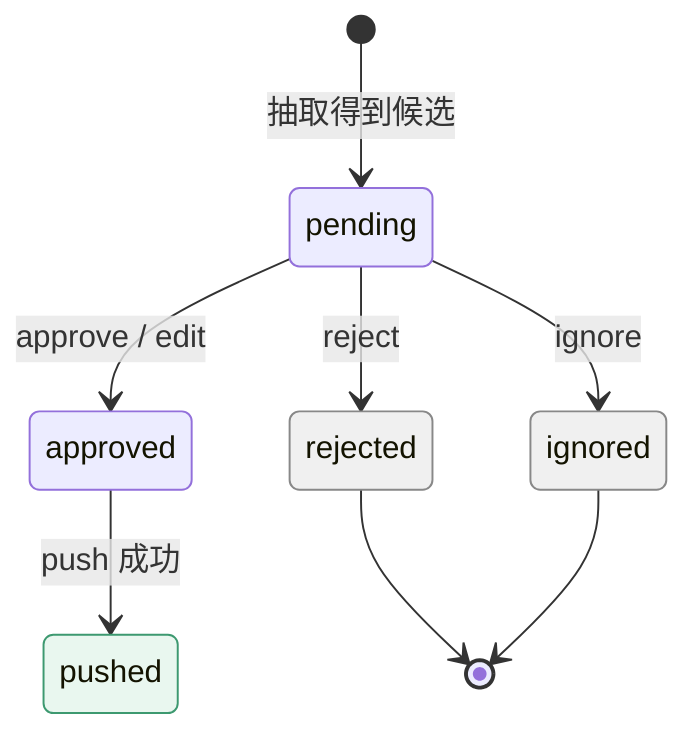
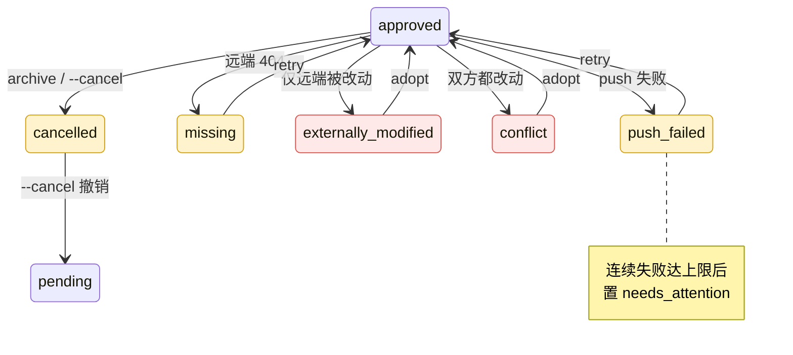
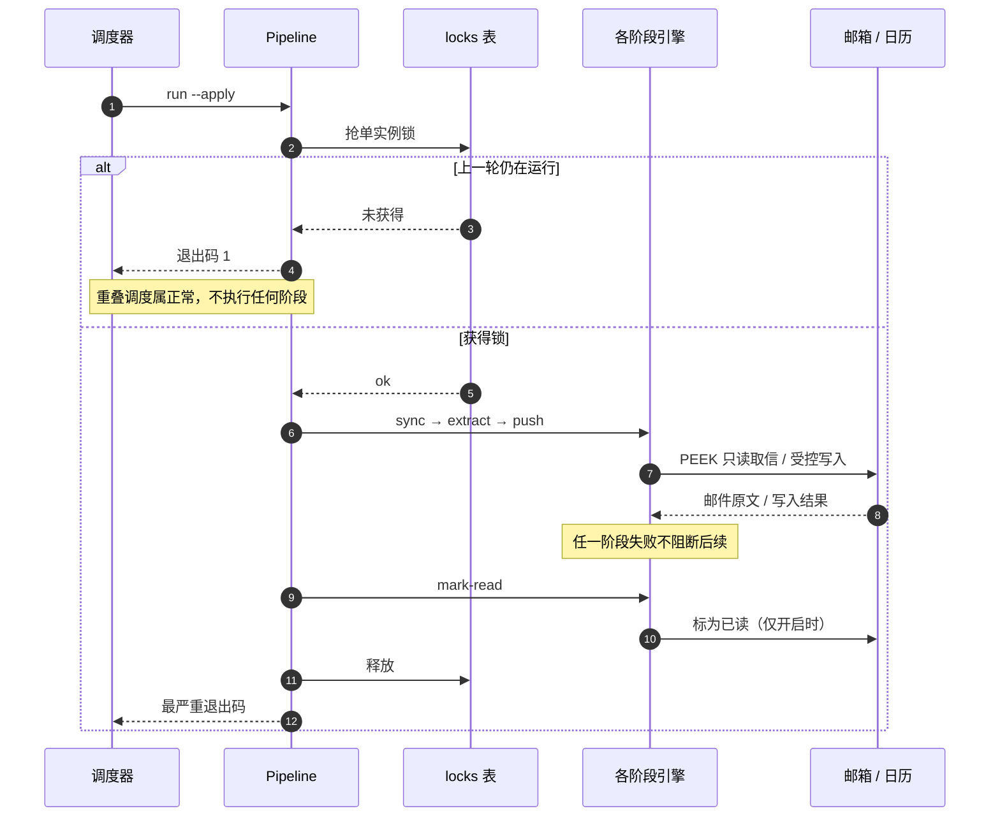
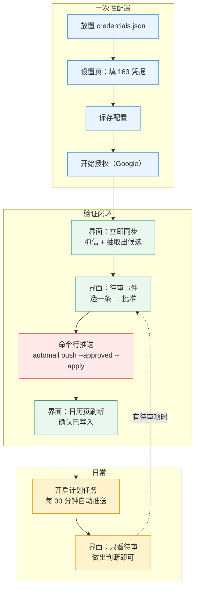
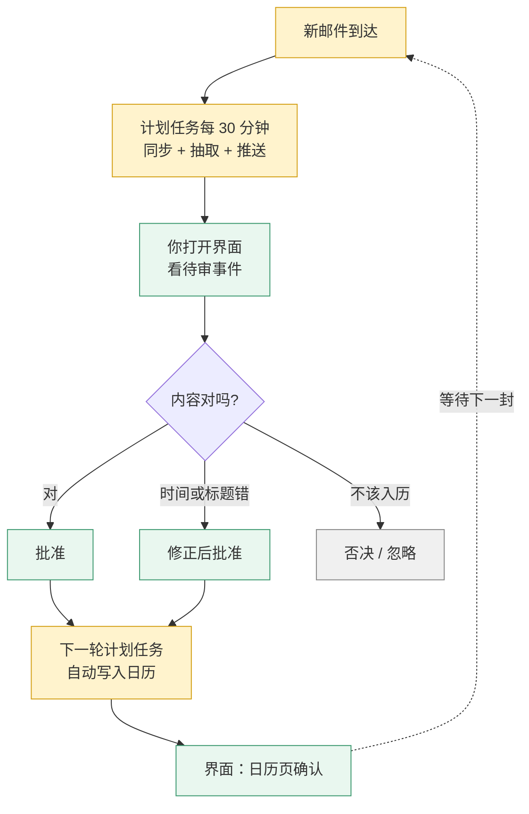
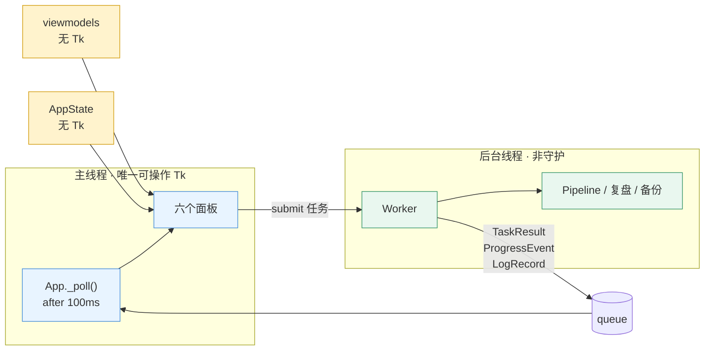

# auto-mail

自用网易邮箱（163）管理助手。核心目标：**不用每天翻邮件**——从邮件正文里
抽取事件时间，写入 Google 日历；并逐步把摘要、待办、回复追踪、订阅清理
这些重复劳动自动化。

**当前进度：全部阶段（P0–P6）已实现并端到端验证。**
真实 Google 日历接入已在真实 API 上确认有效（见 [验证报告](docs/eval-real-gcal.md)）。

日历写入使用真实 Google Calendar（需 `credentials.json` 并运行一次 `automail auth`）。
也可用 `--backend fake` 走内存实现演练，此时事件**不会**写入真实日历。

---

## 目录

- [系统架构](#系统架构)
- [数据流](#数据流)
  - [抽取分层](#抽取分层ics--规则--llm)
  - [事件状态机](#事件状态机)
  - [一次 `run` 的执行与并发安全](#一次-run-的执行与并发安全)
  - [三层账本与幂等键](#三层账本与幂等键)
- [快速开始](#快速开始)
- [典型使用流程](#典型使用流程)
- [两种使用方式](#两种使用方式)
- [图形界面](#图形界面)
  - [图形界面操作指引](#图形界面操作指引)
- [命令一览](#命令一览)
- [抽取质量](#抽取质量实测)
- [需要准备的三样凭据](#需要准备的三样凭据)
- [配置](#配置)
- [设计原则](#设计原则为什么这样做)
- [隐私与安全](#隐私与安全)
- [定时运行](#定时运行windows-任务计划)
- [已知限制](#已知限制163-服务端行为)
- [已知实现偏差](#已知实现偏差待修)
- [开发](#开发)
- [路线图](#路线图)

> 全文含 9 张 Mermaid 图：架构、数据流、抽取分层、状态机（正常路径 / 异常路径各一张）、
> 并发时序、GUI 线程模型、GUI 操作闭环（首次配置 / 日常使用各一张）。
> 所有图均可直接在 GitHub 上渲染，无需插件。

---

## 系统架构

五层结构：**入口层**驱动**编排层**，编排层调度**业务层**，业务层只通过
**适配层**访问外部系统，全部状态落在一个 SQLite 里。



实线是「调用」，虚线是「读写本地状态」。每个业务模块只经由一个适配层实现
触达外部系统（例如只有 `PushEngine` 会碰日历），因此后端可以整体替换成
`FakeCalendar` 做演练。

`threads` / `digest` / `audit` / `stats` 是只读旁路工具（读库、写本地文件），
不参与主链路，故未画出。
> 两张图都做了精简：`Windows 任务计划` 与 `GUI Worker` 只是入口层/编排层的另外两种驱动
> 方式（前者走 `scripts/run.ps1` 调同一个 CLI，后者是 GUI 的后台线程），`MIME 解析`
> 是 `SyncEngine` 内部的一步而非独立依赖，`threads / digest / audit / stats` 是旁路工具
> 且不参与主链路——它们的细节见下方职责表与目录结构。

### 分层职责

| 层 | 主要模块 | 职责 | 刻意不做的事 |
|---|---|---|---|
| 入口层 | `cli.py` / `gui/` / `scripts/*.ps1` | 参数解析、渲染、把动作翻译成一次调用 | 不含业务规则 |
| 编排层 | `pipeline.py` | 阶段顺序、单实例锁、退出码取最严重 | 不解析邮件、不构造日历 payload |
| 业务层 | `mail/sync.py`、`extract/`、`review.py`、`push.py`、`read_state.py`、`threads.py`、`digest.py`、`audit.py` | 领域逻辑与状态机 | 不直接碰 IMAP / Google SDK |
| 适配层 | `mail/imap_backend.py`、`mail/mime.py`、`extract/llm.py`、`calendar/` | 协议实现，可替换（真实 ↔ Fake） | 不决定「该不该写」 |
| 存储层 | `db.py`（基础设施）、`store.py`（邮件域仓库）、`migrations/` | 连接、PRAGMA、迁移、备份、锁、运行记录 | 不含业务判断 |

> 为什么把 `db.py` 与 `store.py` 分开：前者是**基础设施**（连接/迁移/备份/锁/
> 运行记录），后者是**邮件领域的读写**。混在一起会让 db 无限膨胀，且基础设施的
> 读者被迫面对邮件字段细节。

### 目录结构

```
src/automail/
├── cli.py                 命令行入口（typer 应用，全部子命令）
├── __main__.py            可执行入口：python -m automail 与打包 exe 共用
├── gui_main.py            窗口化入口（--selftest 供构建脚本自检）
├── pipeline.py            主流程编排：锁 + 阶段序列 + 退出码
│
├── db.py                  SQLite 基础设施：连接/PRAGMA/迁移/备份/锁/runs
├── store.py               邮件域仓库：messages / processed_mail / sync_state / senders
├── models.py              状态枚举与轻量 dataclass（状态的单一事实来源）
├── settings.py            配置层：.env / 环境变量 → Settings
├── migrations/            001_initial … 004_messages_marked_read（前向迁移）
│
├── mail/                  IMAP 后端、MIME 解析与清洗、头部解码、增量同步
├── extract/               预筛器 / ICS 直解 / 规则引擎 / LLM 抽取 / 流水线 / 离线评测
├── calendar/              CalendarBackend 协议、GCal 实现、Fake、OAuth、规范化、所有权
│
├── review.py              审核队列：审批、修正、接管、重试、延迟推送窗口
├── push.py                推送引擎：受控写入、幂等反查、三方比对、归档/删除
├── read_state.py          已读回写（本项目唯一的邮箱写操作）
├── audit.py               抽取复盘：最近哪些邮件可能没抽对（只读）
├── threads.py             线程重建（163 无服务端 THREAD）
├── digest.py              每日摘要（Markdown，落 out/）
├── stats.py               只读统计
├── doctor.py              自检（离线 / --live 联网）
├── backup / pause / portable / secrets_store / envfile / logging_setup / sanitize …
└── gui/                   窗口层（唯一碰 Tk 的地方）+ state/worker/viewmodels（可单测）

tests/                     全程离线、不碰真实凭据；fake_imap.py 起真实 TCP 假服务器
docs/                      spec-*.md 设计规格、eval-*.md 评测报告、portable-usage.md
scripts/                   任务计划安装 / 构建 / 运行包装
```

---

## 数据流

一封邮件从信箱到日历，要经过同步、抽取、人工审批（或白名单直通）、受控写入
四道关口。**写邮箱和写日历是两个方向的尽头**，中间全部是可回滚的本地状态。



实线是**主链路**，虚线是**反馈与旁路**。为控制在可读的尺寸内，两处细节移到这里
（图示已按 skill 的「宁可丢进正文，不要塞进图里」处理）：

* **同步取信的确切方式**是 `EXAMINE`（只读选中）+ `BODY.PEEK[]`（不置已读标志），
  全程不发任何 STORE；这是「邮箱默认只读」的实现基础。
* **`events.status` 的中间态**（`pending` / `approved` / `pushed` / `push_failed` / 冻结态…）
  都落在同一个 `events` 表里，上图合并为 `DB` 一个节点；完整转移见下方状态机。
* **旁路工具**（`audit` → `out/` 报告、`digest` 摘要、`threads` 线程重建）不参与主链路，
  只读库并写本地文件，故未画出。

读这张图的三个要点：

* **`push` 是唯一的日历写入口**，且只处理 `approved`；`pending` 永不写入。
* **`mark_read` 是唯一的邮箱写入口**，默认关闭，且只改 `\Seen` 一个标志。
* 虚线是**反馈/派生**路径：`scheduled_pushes` 只是调度队列（不属于事件状态机），
  从日历回写的哈希用于下一轮检测用户手改。

### 抽取分层（ICS → 规则 → LLM）

抽取按成本和可信度从高到低分层：**能确定解的绝不去问 LLM，能便宜的绝不去问贵的**。



ICS / 规则 / LLM 三者是**降级关系**（虚线：上一级拿不到结果才走下一级），
但三者的产出都会进入合并去重——ICS 与规则可以同时命中同一封邮件。

白名单（可直接 `approved`）只有两条，其余一律 `pending`：

1. `source=ics` 且 `METHOD:REQUEST` 且 `organizer` 非空、起止可解析、时间在未来、
   发件人是联系人；
2. `source=rules` 且 `confidence > 0.85`（**严格大于**，实际只有 0.95 档可过）。

**全部 `source=llm` 恒进待审**——误写日历的代价高于漏识别。

### 事件状态机

`events.status` 是唯一状态源；`scheduled_pushes.state` 只是调度队列，不属于本状态机。

状态机按「正常路径」与「异常/冻结路径」拆成两张，因为 12 个状态放进一张图后
会宽到无法阅读。

**正常路径与终态**：



**异常与冻结路径**（全部从 `approved` / `pushed` 出发，且大多能回到 `approved`）：



`pushed` 上还挂着三条同类转移（检测到手改 → `externally_modified`、双方都改 →
`conflict`、`archive` → `cancelled`），与上图 `approved` 出发的三条完全对应，
故未重复画出。

**冻结态**（`externally_modified`、`conflict`）禁止任何 update/delete。
唯一的出路是 `adopt`（以当前远端为新基线，承认用户的改动，回到 `approved`）。
`reject` / `ignore` / `approve` 三个动作**都只允许从 `pending` 出发**
（`_ALLOWED_*_FROM = {pending}`）——事件一旦离开待审就不该被当作待审项撤销，
否则「已批准的事件被一个误触的 reject 静默抹掉」是可能的。

`--cancel` 后回到 **`pending`** 而不是 `approved`：撤销意味着用户收回了自动推送的
授权，回到 `approved` 会被自动流程再次消费，等于撤销无效。

#### 已定义但当前无代码路径产生的状态

如实标注，避免读者以为这些状态在运行中真会出现：

| 状态 | 规格中的含义 | 现状 |
|---|---|---|
| `uncertain` | 反查 Google 时请求本身报错，无法判定远端是否已有该事件 | 在枚举、CHECK 约束与 `retry`/`digest` 的过滤条件里都支持，但**没有任何代码路径写入它**——反查失败目前被当作 `push_failed` 处理 |
| `superseded` | 被同 `ics_uid` 的更高 `SEQUENCE` 取代 | 已列入终态集合，但 v1 不展开 `RRULE`、未实现 SEQUENCE 比较，因此不会被写入 |

两者都是在为后续版本预留的槽位：库结构与过滤逻辑已经就位，接入时不需要迁移。

### 一次 `run` 的执行与并发安全

`automail run` 由 Windows 任务计划每 30 分钟触发一次，因此**必须假设会重叠**。



四个阶段各自与外部系统的具体调用（同步用 `EXAMINE` + `BODY.PEEK`、
推送先按 `auto_mail_key` 反查再写入等）在上文的架构图与数据流图里已标注；
时序图这里合并为「各阶段引擎」以保证可读性。

两层防线，缺一不可：

| 层 | 机制 | 作用 |
|---|---|---|
| 第一层 | `locks` 表 + `owner_run_id` + TTL 抢占 | **减少无谓工作**（少连一次邮箱、少一次日历调用） |
| 第二层 | 同步游标 / 抽取唯一索引 / 推送幂等反查 / 摘要同日覆盖 | **保证正确性**——锁失效时也不会产生重复 |

**锁不是正确性的单点依赖**：锁只覆盖单次 `Pipeline.run()`，第二个进程可能在第一个
释放锁后才拿到。此时靠下层的幂等性顶住（测试用例
`test_idempotency_holds_when_runs_overlap` 专门覆盖这条路径）。

用数据库锁而非文件锁的原因：崩溃残留的锁会在 TTL 后**自动失效**，不需要人工清理；
文件锁的残留会永久阻塞。

### 三层账本与幂等键

同一个「进度」被刻意拆成三个互不重叠的账本，避免出现两套平行账本互相打脸：

| 账本 | 字段 | 只回答 |
|---|---|---|
| sync 层 | `processed_mail.status` | 这封邮件**是否已抓取入库** |
| extract 层 | `messages.extract_status` | 抽取**进行到哪一步** |
| 预算层 | `messages.extract_attempts` | 这封邮件**被 LLM 尝试过几次**（防毒邮件持续烧钱） |

各层的幂等键：

| 层 | 幂等键 | 重复执行的后果 |
|---|---|---|
| 同步 | `UNIQUE(account, folder, uid_validity, uid)` + `highest_uid` 游标 | 不重复入库 |
| 抽取 | `UNIQUE(message_id, fingerprint)` | 不重复产出候选 |
| 推送 | create 前按 `auto_mail_key` 反查，命中则回填 | 日历里不会出现重复事件 |
| 摘要 | 文件名 `digest-YYYY-MM-DD.md`（按本地日期） | 同日覆盖同一个文件 |

---

## 快速开始

```bash
# 1. 创建虚拟环境并安装（Windows / Git Bash）
python -m venv .venv
.venv/Scripts/python.exe -m pip install -e .

# 2. 自检（无需任何凭据即可运行）
.venv/Scripts/automail.exe doctor

# 3. 配置 163 授权码后，先预览同步（不写库）
cp .env.example .env      # 填入 IMAP_USER / IMAP_AUTH_CODE
.venv/Scripts/automail.exe sync            # dry-run：只报告将要发生的变化
.venv/Scripts/automail.exe sync --apply    # 真正写入本地数据库

# 4. 离线评测抽取质量（不联网、不花钱）
.venv/Scripts/python.exe -m tests.evaluate --write
```

**所有写操作默认 dry-run**，必须显式 `--apply` 才真正执行。

`doctor` 退出码约定，可直接用于计划任务判断：

| 退出码 | 含义 |
|---|---|
| `0` | 全部就绪 |
| `1` | 部分项缺失（例如尚未配置密钥）——**不算失败** |
| `2` | 致命（配置非法、依赖缺失、数据库不可用） |

`run` 的整体退出码同样取**最严重**的阶段。两个关键判断：网络/风控失败记为 1 而非 2
（下次会重试，当致命会让任务反复告警）；检测到用户手改而冻结记为 1
（这是正确行为，但需要人处理，不能报成功而无提示）。

## 典型使用流程

```bash
automail sync --apply          # 1. 同步邮件（只读邮箱）
automail extract --apply       # 2. 抽取出事件候选（全部进待审）
automail events list           # 3. 查看待审事件（含来源邮件与依据）
automail events approve 12,15  # 4. 批准（支持 1,2 或 1-5）
automail events reject 13      #    或否决
automail events edit 14 --title "面试" --start 2026-09-23T06:00:00Z
automail push --approved --apply   # 5. 写入日历

automail threads --apply       # 可选：重建邮件线程
automail digest                # 生成每日摘要到 out/
automail audit                 # 抽取复盘：最近 24h 哪些可能没抽对（只读）
automail mark-read             # 可选：把处理完的邮件标为已读（默认 dry-run）
automail stats                 # 查看只读统计
```

**审批与推送是分开的两步**：人的判断（approve）不该被技术故障吞掉。
即使推送时断网，审批结果也已落库，下次 `push` 继续。

### 安全保证（都有测试覆盖）

| 保证 | 说明 |
|---|---|
| 只写已批准的事件 | `pending` 永不写入 |
| 创建前先反查 | 按 `auto_mail_key` 查一次，命中则**回填**而非新建——覆盖「创建成功但写库前崩溃」，避免重复事件 |
| 只动自己创建的事件 | 所有权标记不匹配 → 冻结，绝不触碰 |
| 检测用户手改则冻结 | 三方比对（快照/远端/本地规范化哈希），不覆盖用户的修改 |
| 删除默认归档 | 置为 `cancelled`（可恢复）；硬删除需显式 `--hard-delete` |
| 撤销真的生效 | `--cancel` 后事件回到 `pending`，不会被自动流程再次消费 |
| 默认 dry-run | 所有写操作需 `--apply` |
| 邮箱默认只读 | 同步全程 `EXAMINE` + `BODY.PEEK`；唯一的写操作（已读回写）默认关闭 |
| 只改 `\Seen` 一个标志 | 已读回写的后端接口不含删除/移动/改其它标志的能力 |
| UIDVALIDITY 不符则拒绝写 | UID 一变动就可能指向别的邮件，此时绝不回写 |

## 两种使用方式

* **便携版（推荐日常使用）**：打包成 exe，双击运行，目标机器不需要 Python。
  见 [便携版使用指南](docs/portable-usage.md)。
* **源码运行（开发/调试）**：见下方「快速开始」。

## 图形界面

双击 `auto-mail-gui.exe`（便携版）或运行 `python -m automail` 并设
`AUTOMAIL_GUI=1`（源码）。六个标签页：

| 页面 | 用途 |
|---|---|
| **总览** | 待审数量、配置状态、立即同步（带真实进度）、暂停自动运行、快捷入口、日志 |
| **待审事件** | 批准/否决/忽略/修正/接管。冲突与「疑似重复」都标在行上 |
| **邮件** | 列表（全部/未读/有事件/抽取失败…）+ 详情（脱敏正文片段、抽出的事件、抽取依据） |
| **日历** | 今天与未来 7 天，可跳到 Google 日历 |
| **复盘** | 「很可能漏抽 / 值得留意 / 未判定」三类分组，即 `automail audit` 的可视化 |
| **设置** | 163 账号与授权码、LLM、Google 授权、策略、计划任务注册 |

### 图形界面操作指引

面向希望少碰命令行的使用者。

> **⚠️ 先读这一条：目前界面无法把事件写入日历。**
>
> 界面上的**「立即同步」虽然会跑完整的 `run`（含 push 阶段），但它没有把
> 日历后端传进去**，因此推送阶段会直接报
> `'NoneType' object has no attribute 'find_by_auto_mail_key'` 并跳过。
> 更麻烦的是：界面**不展示阶段级的失败详情**，所以整个过程看起来仍然
> 「完成」——批准过的事件会一直停在「已批准，等待写入日历」，看不出原因。
>
> **所以当前唯一可靠的写入方式是命令行：**
>
> ```bash
> automail push --approved --apply     # 把已批准的事件写入日历
> ```
>
> 这是需要修的实现问题（详见下方「已知偏差」），此处如实说明而不是
> 包装成正常流程。以下指引按「**界面做判断、命令行做写入**」的现状编写；
> 等你修好 `overview.py` 的 calendar 传参后，把第 4 步换成界面操作即可。

因此，界面的定位是**审批台**：同步、抽取、看待审、看结果都在界面里完成，
唯独「写入日历」这一步目前要走命令行。

#### 一次性配置

| 顺序 | 位置 | 操作 |
|---|---|---|
| 1 | 文件系统 | 把 Google 下载的 OAuth JSON 重命名为 `credentials.json`，放到程序目录（便携版）或项目根目录（源码运行） |
| 2 | 设置页 → 163 邮箱 | 填「邮箱账号」与「授权码」（16 位，**不是**登录密码） |
| 3 | 设置页 → 大模型（可选） | 填「接口地址」「API Key」「模型名」；留空则抽取降级为「仅规则 + ICS」，不会假装成功 |
| 4 | 设置页 | 点「保存配置」——凭据用 Windows DPAPI 加密写入 `data/secrets.dat`，`.env` 里的明文会被清空 |
| 5 | 设置页 → Google 日历授权 | 点「开始授权…」，会打开浏览器，需手动点「允许」 |
| 6 | 设置页（可选） | 点「注册计划任务」，之后每 30 分钟自动运行一次 |

> 第 5 步**必须**先完成第 1 步，否则授权会失败。若浏览器里登录了多个 Google
> 账号，用无痕窗口打开授权链接，避免选中未列入测试用户的那个账号。

#### 用一封真实邮件走通闭环

配置完成后，先用**一封**邮件验证整条链路能通。红色那步是命令行——原因见本节开头的说明：



具体操作顺序：

1. **总览 → 「立即同步」**，等进度条走完。这一步会抓取邮件并抽取出候选
   （推送阶段会失败，但**不影响**前两个阶段的结果）。
2. 切到**「待审事件」**，「状态」筛选保持为「待审」。
3. **选中一条 → 点「批准」**。状态变为「已批准，等待写入日历」。
4. **在命令行执行推送**（当前唯一可靠的写入方式）：

   ```bash
   automail push --approved --apply
   ```

   便携版在程序目录下执行 `auto-mail.exe push --approved --apply`。
5. 切回**「日历」→ 「刷新」**，确认该事件出现在「今天与未来 7 天」里。

**最容易卡住的就是第 4 步**：批准本身不写日历，而界面点了「立即同步」也不会写
（它拿不到日历后端）。跳过第 4 步，事件会一直停在「已批准，等待写入日历」
——数据没丢，只是没被推送。

> 首次同步大邮箱时（数千封），界面上的「立即同步」**不带条数上限**，
> 一次性拉取过多可能触发 163 风控。建议先用命令行分批：
> `automail sync --apply --limit 200`，多跑几次，之后再用界面。

#### 日常使用

走通之后，日常就只剩「看一眼、点一下」：



**注册计划任务后，「写入日历」是自动的**——计划任务走的是命令行入口
（`scripts/run.ps1` → `automail run --apply`），它正确传入了日历后端，
因此每 30 分钟会自动把已批准的事件推送到日历。你只需要在界面里做判断，
最迟 30 分钟内会落进日历。

这也是当前推荐的日常形态：**界面做判断，计划任务做写入**。两者都缺一不可——
界面手点的「立即同步」不会推送（见本节开头），所以若没开计划任务，
就必须手动执行 `automail push --approved --apply`。

**「总览」页的「暂停自动运行」只挡计划任务**，不挡你手点的「立即同步」
——点它表示你现在就想跑一次同步与抽取。

#### 每个状态词对应的动作

| 界面显示 | 含义 | 你该做什么 |
|---|---|---|
| 待审 | 抽取出候选，等你决定 | 批准 / 修正 / 否决 / 忽略 |
| 已批准，等待写入日历 | 你的决定已记录，但还没写进日历 | 总览点一次「立即同步」；注册了计划任务则最迟 30 分钟内自动完成 |
| 已写入日历 | 完成 | 无需动作，可在「日历」页跳转查看 |
| 写入失败 | 推送时网络或日历 API 出错 | **界面无法恢复**，用命令行 `automail events retry <id>` |
| 存在冲突 / 被外部修改 | 日历里的内容与记录不一致，程序已**停止写入** | 点「接管」以日历现状为准，或「否决」 |
| 日历中已不存在 | 该事件在 Google 侧被删除了（404） | **界面无法恢复**，用命令行 `automail events retry <id>` 重建 |

「待审事件」页的状态筛选有四个选项：**待审 / 已批准 / 需要关注 / 全部**。
「需要关注」是后四行的集合，日常扫一眼这个筛选就够。

> ⚠️ **上表最后两行目前是界面的盲区**（如实说明，非设计意图）。
> 界面**没有「重试」按钮**，而这两种状态只有 `retry` 能恢复，因此只能在
> 命令行执行 `automail events retry <id>`。
> 更要留意的是：这两种状态下点「批准」**不会报错，但也不会生效**——
> 后台会返回「跳过 1」，而界面不展示跳过原因。看到「成功 0」却没有解释时，
> 就是这个情况，请不要反复点击。
> 相比之下命令行会打印原因（`events approve` 会说明「当前为 push_failed
> 不允许 approve」），所以遇到卡住的事件时，命令行是更可靠的入口。

#### 每个按钮做什么

| 按钮 | 作用 | 使用时机 |
|---|---|---|
| **批准** | 记录「同意写入日历」 | 内容正确时 |
| **修正…** | 改标题与开始时间，**改完即视为已批准** | 抽取的时间或标题不对时 |
| **否决** | 终态，不再提示 | 这件事不该进日历 |
| **忽略** | 终态，同一指纹不再入队 | 重复提醒、噪音通知 |
| **接管** | 以日历现状为新基线并解冻 | 仅冻结态（冲突 / 被外部修改）可用 |
| **详情** | 展开来源邮件、抽取依据、与日历的差异 | 拿不准该不该批准时 |

两点容易踩到的细节：

* **冻结态点「批准」不会生效**，界面会提示「需要先接管」。这是状态机不允许的
  转移，属于设计如此，不是故障。
* **「修正…」的时间格式**为 `YYYY-MM-DD HH:MM`，**留空表示不修改该项**。
  标题不能留空。修正走的是与命令行完全相同的解析逻辑，不存在两套格式。

#### 其余三个页面

| 页面 | 什么时候看 |
|---|---|
| **邮件** | 想核对某封原始邮件时。可搜索、看脱敏正文片段、看抽出了什么事件与依据；**这里不能审批**，只读 |
| **复盘** | 每周扫一次，确认没有「很可能漏抽」。它即 `automail audit` 的可视化 |
| **日历** | 写入后确认结果。选中已写入的事件可跳转到 Google 日历（未写入的事件无法跳转，会在提示里说明） |

界面层严格分成两半，**只有窗口层能碰 Tk**：



三条实现约束（都有具体理由，不是风格偏好）：

1. **后台线程只往队列里放事件，主线程用 `after()` 取。** Tk 不是线程安全的，
   从工作线程直接改控件会随机崩溃。
2. **线程是非守护的。** 守护线程会在主线程退出时被直接杀掉，可能留下半成品事务与
   **未释放的运行锁**（锁在 `finally` 里释放，被强杀就释放不了）。
3. **配置保存后重建依赖对象。** `Pipeline` 在构造时就绑定了 settings，
   不重建会出现「设置已保存但不生效」。

几个刻意的设计（详见 [图形界面规格](docs/spec-gui.md)）：

* **批准不等于已写入日历**。`approve` 只记录你的决定，推送由 `push` 单独执行
  ——这样即使推送时断网，人的判断也不会丢。界面上显示「已批准，等待写入日历」。
* **被外部修改/冲突的事件要用「接管」，不能直接批准**（状态机不允许）。
  按钮给错会让人反复点击却毫无反应。
* **凭据用 Windows DPAPI 加密**存 `data/secrets.dat`，`.env` 里的明文会被迁移
  并清空。改造顺序是**先验证后擦除**：加密写完并回读校验通过才清明文，
  否则保留明文——宁可继续用明文，也不能两边都没有。
  （DPAPI 的边界：同用户态下任意进程都能解密，它防的是文件被拷走/同步。）
* **暂停自动运行只挡计划任务**，不挡界面上的「立即同步」——点它说明你现在
  就想跑一次，与"别在我不知情时自动跑"是两件事。
* **关窗时若任务在跑**，给「完成后退出 / 继续在后台」，**不提供强杀**：
  强杀会让运行锁滞留到超时（默认 30 分钟），期间计划任务全部报
  「已有运行在进行中」。

**做不到的事**（如实说明）：163 无法深链到具体邮件（网页 URL 是会话式的），
只能打开首页 + 提供「复制主题」；Google 日历链接按 `gcal_event_id` 尽力拼，
拼不出就退回日历首页。

## 命令一览

```
automail doctor [--live] [--json]        自检；默认离线，--live 才联网（含真实 IMAP 检查）
automail runs [-n N]                     查看最近运行记录
automail sync [--apply] [--limit N]      从 163 增量同步邮件（只读邮箱）
automail extract [--apply] [--limit N]   抽取事件候选（ICS → 规则 → LLM）
automail events list [-s STATUS]         查看事件（-s pending/approved/pushed/frozen/failed/all）
automail events approve|reject|ignore 1,2 审批（支持 1,2 或 1-5 批量）
automail events edit <id> --title/--start 人工修正（记为 human，不被自动覆盖）
automail events adopt <id>               接管被外部修改的事件（解冻）
automail events retry <id>               重置推送失败的事件
automail push [--approved] [--apply]     写入日历（--due 处理到点、--cancel 撤销窗口内）
automail run [--apply] [--digest]        串起全流程（--no-sync/--no-extract/--no-push）
                                         （受暂停标记影响，加 --ignore-pause 可强制跑）
automail threads [--apply]               重建邮件线程（163 无服务端 THREAD）
automail digest [--open]                 生成每日摘要（Markdown，落 out/）
automail audit [--hours 24] [--show <id>] 抽取复盘：最近哪些邮件可能没抽对（只读）
automail mark-read [--apply] [--undo]    把处理完的邮件标为已读（默认 dry-run）
automail stats [--json]                  只读统计（含降级/跳过指标）
automail pause [--resume]                暂停/恢复计划任务的自动运行
automail setup [--quiet]                 便携版首次运行引导
automail backup [--prune-only]           备份数据库并清理超期备份
automail auth [--status|--revoke]        Google OAuth 授权（含状态查询、换账号）
```

评测入口（离线、零成本）：

```
python -m tests.evaluate                 打印抽取质量报告
python -m tests.evaluate --write         写入 docs/eval-report.md
```

## 抽取质量（实测）

| 指标 | 合成语料（17 封） | 真实邮件（89 封 + 1 封未来事件样本） |
|---|---|---|
| 召回率 | 100% | 未来事件样本 **3/3 命中**；整体召回率未验证 |
| 精确率 | 100% | — |
| **自动入历准确率**（最关键） | 100% | **100%**（0 个错误写入） |
| 预筛过滤率 | — | 52%（46/89 封） |

首批 89 封真实邮件里**没有一个未来的事件**（那批邮件最晚 8 月下旬收到，内容全已
过期），因此只能证明「不会做出危险动作」。这个缺口后来由一封真实的**未来事件
邀请函**补上——三个真值事件全部命中，时间与标题都正确，同时暴露并修复了 8 个缺陷。
详见 [真实数据验证](docs/eval-real-data.md)。

整体召回率仍**未验证**：单个（且是自己转发进来的）样本不足以支撑这个数字。
详见 [合成语料评测](docs/eval-report.md)。

### 抽取复盘（`automail audit`）

抽取质量靠**真实邮件**迭代，而不是靠想象。`audit` 每天跑一次，回看最近 24
小时收到的邮件，回答一个问题：**哪些可能没抽对？**

它只读数据库、只写本地报告（`out/audit-<日期>.md`），**不碰邮箱、不碰日历、
不改库**。默认也**不调用 LLM**——复盘是给人看的，不是再花一次 token 得到
同样的答案。

报告把邮件分成三类，重点在**静默失败**：

| 分类 | 含义 |
|---|---|
| 很可能漏抽 | 抽取本该有结果却没有。最危险的一类——流程照常报成功，看不出少了什么 |
| 值得留意 | 有可疑迹象，但可能是正常情况（例如通知类邮件确实没有时间） |
| 未判定 | 本该由 LLM 兜底，而本轮没调 LLM → **观测能力的缺口，不是邮件的问题** |

最后一类是被单独分出来的，不是漏报。实测 72 小时窗口里，最初 16 个可疑项有
15 个都是同一句「未配置 LLM」——那是**一个全局配置状态**，逐封报告会把真正
的信号淹掉，报告也就没人看了。现在它只在报告头部说明一次，并单独计数。

```
automail audit                    # 复盘最近 24 小时
automail audit --hours 72         # 回看 3 天
automail audit --with-llm         # 连同 LLM 一起判断（消耗额度，判定最准）
automail audit --show 92          # 打印单封邮件的完整细节（含正文片段）
```

> **复盘本身也修正过两次误报**，都写进了测试：LLM 的输出每次都不完全一样，
> 所以过时判定只比较确定性来源（规则/ICS）；离线重跑看不到「定时取代全天」
> 这类跨来源合并，因此那种情况下跳过判定。取舍一致：**宁可漏报，不可误报**。

### 同步是严格只读的

`sync` 使用 `EXAMINE`（只读选中）与 `BODY.PEEK[]`（不改变已读状态）取信，
**不会**标记已读、移动或删除任何邮件。测试里有专门用例断言这一点：
取正文后邮件的 flags 必须保持为空。

首次同步大邮箱建议分批，避免一次性拉取过多触发风控：

```bash
automail sync --apply --limit 200    # 每轮最多取 200 封，可反复执行
```

### 已读回写（唯一会改变邮箱状态的操作）

默认**关闭**。启用后会把「已处理完」的邮件标为已读，让「未读」继续表示
「需要你处理」——而不是被已处理的邮件占满。

它只改 `\Seen` 一个标志：不删邮件、不移动、不改别的标志。启用方式：

```bash
# .env
MARK_READ_POLICY=resolved    # off（默认）| resolved | processed
```

然后先看 dry-run，确认要标的是哪些，再加 `--apply`：

```bash
automail mark-read                      # 只报告，不发任何 STORE
automail mark-read --limit 3 --apply    # 先标 3 封试水
automail mark-read --undo --apply       # 标错了：恢复为未读
```

| 策略 | 含义 |
|---|---|
| `off` | 不开启（默认） |
| `resolved` | 只在**没有任何事件等你处理**时才标（推荐） |
| `processed` | 所有抽取完成的邮件都标 |

`resolved` 有两道保守判断，都是为了不把「其实要你做事」的邮件藏起来：

1. 事件仍处于 `pending` / `uncertain` / `push_failed` → 保持未读（那正等着你）。
2. 主题或发件人像在等你响应（邀请、确认、回复请求、截止日期…）→ 保持未读。
   这条是实测补的：GitHub 的仓库邀请不产生日历事件，按「无事件即已处理」
   会被标掉——而它显然需要你回应。

> ⚠️ **启用后计划任务会自动标记。** `automail run --apply` 每 30 分钟执行一次，
> 其中包含已读回写。也就是说改完 `.env` 就等于让它在后台自动整理邮箱，
> **不再需要每次手动确认**。想先人工复核就别用 `run`，只手动跑 `mark-read`。
>
> 写入前有一道硬闸门：库中 `UIDVALIDITY` 与服务端不一致时**拒绝回写**
> ——UID 一变就可能指向完全不同的邮件，那时继续写会标到别人的邮件上。
> `--undo` 只恢复本程序标记过的（记在 `marked_read_at`），
> 你自己在别的客户端读过的不会被碰。

## 需要准备的三样凭据

163 授权码与 Google 凭据用于真实接入；LLM 凭据可选（未配置时抽取降级为仅规则 + ICS）。

### 1. 163 邮箱授权码

第三方客户端**不能**用网页登录密码，必须用 16 位「客户端授权码」：

1. 登录 163 网页版 → **设置** → **POP3/SMTP/IMAP**
2. 开启 **IMAP/SMTP 服务**（需绑定手机的短信验证）
3. 点击 **新增授权密码** → 得到 16 位授权码

> 授权码**只显示一次**，请立即保存。每个客户端可单独生成一个。

填入 `.env`：

```ini
IMAP_USER=yourname@163.com
IMAP_AUTH_CODE=你生成的16位授权码
```

### 2. Google Calendar 凭据

1. 在 [Google Cloud Console](https://console.cloud.google.com/) 新建项目
2. **API 和服务** → **库** → 启用 **Google Calendar API**
3. **OAuth 同意屏幕**（现名 **Google Auth Platform**）：
   - **Branding**：填写应用名与用户支持邮箱
   - **Audience**：用户类型选 **外部（External）**，
     并在 **测试用户** 里 **+ Add users** 添加你实际用来授权的 Google 账号
4. **凭据** → **创建凭据** → **OAuth 客户端 ID** → 类型选 **桌面应用**
5. 下载 JSON，重命名为 `credentials.json` 放到项目根目录
6. 运行 `automail auth`（会打开浏览器授权，需要你点「允许」）

> ⚠️ **第 3 步的「测试用户」最容易漏，漏了必然失败。**
> `calendar.events` 属**敏感** scope，应用处于「测试」发布状态时只有
> 名单里的账号能授权——而**项目所有者不会自动进入该名单**，必须手动添加自己。
> 漏掉它的表现是授权页显示「**错误 403：access_denied**」，且因为 Google 不回跳，
> 程序侧只能看到「等待回调超时」。程序会在报错时把这套排查步骤打印出来。

> ⚠️ **浏览器同时登录多个 Google 账号时**，可能自动选了未列入名单的那个。
> 错误页最后一行「联系开发者 `<邮箱>`」写的就是它。用**无痕窗口**打开授权链接
> 可以避免这个问题。

> ⚠️ **关于「Google 尚未验证此应用」**：这是正常的，点「高级 → 继续前往」即可。
> 自建应用不会通过 Google 审核，单人自用也不需要审核。

> ⚠️ **关于 7 天失效**：OAuth 同意屏处于 `Testing` 状态时，敏感 scope 的
> refresh token **可能约 7 天失效**；发布到 `In production` 可能涉及验证流程。
> 本程序会**处理失效并提示重新授权**，不会因此静默失败，但你需要知道这个前提。

授权范围只有 `calendar.events`（查看与编辑日历事件），不含其他 Google 数据。
随时可用 `automail auth --status` 查看授权状态。

### 3. LLM API Key（境内服务优先）

抽取用 OpenAI 兼容接口。境内服务优先，**邮件内容不出境**：

```ini
LLM_BASE_URL=https://api.deepseek.com/v1
LLM_API_KEY=sk-...
LLM_MODEL=deepseek-chat
```

未配置时抽取降级为「仅规则」模式并如实报告，不会假装成功。

## 配置

复制 `.env.example` 为 `.env` 后按需修改。所有项都有默认值，
**只有空白的项才需要你填写**。

关键策略项：

| 配置 | 默认 | 说明 |
|---|---|---|
| `USER_TIMEZONE` | `Asia/Shanghai` | 时间解析基准时区 |
| `CONFIDENCE_AUTO_PUSH_THRESHOLD` | `0.85` | 严格大于才自动入历；实际只有 0.95 档可过 |
| `AUTO_PUSH_DELAY_MINUTES` | `5` | 自动入历的可撤销窗口 |
| `AUTO_PUSH_LIMIT_PER_RUN` | `10` | 每轮推送上限，超出顺延 |
| `ICS_AUTO_PUSH_NON_CONTACT` | `false` | 非联系人 ICS 默认进待审（防投毒） |
| `EXTRACT_MAX_ATTEMPTS` | `3` | 逐邮件 LLM 尝试上限（防毒邮件持续烧钱） |
| `NOT_FOUND_POLICY` | `pending` | 远端 404 时的去向：`pending` / `recreate` / `fail` |
| `AMBIGUOUS_DATE_POLICY` | `pending` | 同日多候选的取舍：`pending` / `earliest` |
| `MARK_READ_POLICY` | `off` | 已读回写策略（唯一的邮箱写操作） |
| `EXCERPT_MAX_CHARS` | `4000` | 本地保留的正文片段上限 |
| `EXTRACT_MAX_ATTEMPTS` / `PUSH_MAX_ATTEMPTS` | `3` / `5` | 超过后升级为「需人工关注」 |

配置**保存在 `.env`**；图形界面里的账号密码写入 DPAPI 加密的
`data/secrets.dat`，并同步维护 `.env` 的对应键。

## 设计原则（为什么这样做）

完整规格见 [`docs/`](docs/)：

* [事件状态与审批规则](docs/spec-event-state-machine.md)
* [IMAP 同步一致性与 UIDVALIDITY 处理](docs/spec-imap-sync.md)
* [MIME 解析与正文清洗](docs/spec-mime-cleaning.md)
* [线程重建与摘要](docs/spec-threads-digest.md)
* [主流程编排与并发安全](docs/spec-pipeline-concurrency.md)
* [Google 事件所有权、更新与删除策略](docs/spec-gcal-ownership.md)
* [退订与归档的逐项确认与失败恢复](docs/spec-unsubscribe-archive.md)
* [图形界面规格](docs/spec-gui.md)
* [已读回写规格](docs/spec-mark-read.md)

几条关键取舍：

* **只有 ICS 与高置信规则能自动入历**，LLM 结果一律待审——
  误写日历的代价高于漏识别。
* **邮件正文视为不可信数据**：其中的任何指令都不会改变程序行为，
  写操作只由 CLI 参数、审批状态机与配置驱动（防 prompt injection）。
* **只动自己创建的事件**（带 `auto_mail_key` 标记），
  检测到用户手改则冻结，需显式 `adopt` 才恢复接管。
* **本地只存脱敏正文片段** + 全文哈希，需要时可回 IMAP 重新取信。
* **宁可漏报，不可误报**：复盘工具与冲突判定一致采用保守取向——
  不确定的一律交给人看，而不是猜一个答案。
* **失败必须说明为什么失败**：文件夹级失败带有 `error` 字段，
  而不是只留下一行零值统计。

### 为什么不能用 etag 做条件请求

Google Calendar API v3 **未定义** `If-Match`（已核对官方 discovery 文档）。
因此推送更新走「get → 比对 → update」的乐观流程，接受一个极小的竞态窗口；
真正兜底的是三方哈希比对与幂等反查，而不是条件请求。

## 隐私与安全

以下文件**禁止入库**（已在 `.gitignore` 中）：

```
.env  credentials.json  token.json
data/  *.db  *.db.bak  out/  logs/
tests/fixtures/*.eml      # 测试样本可能含真实邮件
.zcode/                   # 开发过程产物（AI 会话计划草稿）
```

* 摘要与日志默认只记**元数据**（UID / 主题 / 发件人）；
* 异常栈与 `runs.error` **不写邮件正文**，且会剥离控制字符（防终端注入）；
* 数据库备份自动按数量与年龄清理（`DB_BACKUP_KEEP` / `DB_BACKUP_MAX_AGE_DAYS`）；
* 备份与数据库应放在**不受云盘同步的目录**，README 无法替你保证这一点。

### 关于评测文档中的真实数据

`docs/eval-real-*.md` 与相关测试来自真实邮箱与真实日历的验证。为使其可公开，
其中的**机构名、场地名与个人身份信息已替换为泛称**（例如「某大学的邀请函」），
但日期、中文数字写法、排版结构、缺陷分析与判定结果**全部保留原样**——
这些才是报告的技术价值所在，替换泛称不影响任何结论的可复核性。

**已知限制**：本项目**不做数据库加密**。Windows 无法照搬 Unix 的 `chmod`
权限模型，请自行确保 `data/` 目录的访问权限。凭据本身用 Windows DPAPI 加密，
但 DPAPI 只防「文件被拷走/同步」，同用户态下的任意进程仍可解密。

## 定时运行（Windows 任务计划）

一条命令注册全部任务：

```powershell
# 在项目根目录执行（默认：run 每 30 分钟、digest 每天 08:00、
# audit 每天 08:30、backup 每周日 03:00、登录后补处理一次）
powershell -NoProfile -ExecutionPolicy Bypass -File scripts\install-tasks.ps1

# 卸载
powershell -NoProfile -ExecutionPolicy Bypass -File scripts\install-tasks.ps1 -Remove
```

**关机期间收到的邮件怎么处理**：注册一个「登录后跑一次」的补处理钩子。
脚本会按权限自动选机制——管理员用计划任务（`/sc onlogon`，登录后 2 分钟），
普通用户用**当前用户启动文件夹**里的快捷方式（Windows 为该场景提供的标准
机制，无需提权，因为 `schtasks /sc onlogon` 对未提权账号会返回「拒绝访问」）。
两种方式效果相同，`-Remove` 都会清理干净。

也可手动注册单个任务（`scripts/run.ps1` 固定了解释器路径与工作目录，
避免任务计划因环境不同而失败）：

```powershell
schtasks /create /tn "auto-mail run" /sc minute /mo 30 /F ^
  /tr "powershell -NoProfile -ExecutionPolicy Bypass -File D:\Workspace\auto-mail\scripts\run.ps1 run --apply"
```

> **间隔不要低于 15 分钟**：163 不支持 IDLE 只能轮询，过密会触发风控
> 而收到「阻止了一次不安全的收信请求」告警邮件。`install-tasks.ps1` 会
> 拒绝低于 15 分钟的设置。

> **任务只在登录时运行**：注册时不存储密码（`schtasks` 显示「只使用交互方式」），
> 因此关机或未登录期间不会执行。这是刻意的——为个人工具存密码换取后台运行，
> 安全代价大于收益。漏掉的运行会在**下次登录时**由补处理钩子补上
> （见上），日常增量同步也不会丢邮件。

### 阶段之间互不阻塞

`run` 按 sync → extract → push → mark-read 执行，**任一阶段失败不阻止后续阶段**：

| 情况 | 行为 |
|---|---|
| 邮箱风控断开 | 同步失败，但仍抽取本地已有邮件；**下次运行会重新同步**（游标未推进） |
| LLM 未配置 | 抽取降级为仅规则，但仍推送已批准事件 |
| 日历 API 限流 | 推送失败，事件转为 `push_failed`。**不会自动重试**，需 `events retry` 恢复（见下方「已知偏差」） |
| 缺邮箱凭据 | 跳过同步，其余照常（本地重跑很常见） |
| 已读回写未开启 | 该阶段报告「未开启」并跳过，不影响其余阶段 |

`mark-read` 必须在 extract/push **之后**：判定「处理完」依赖抽取结果与事件状态，
跑在前面会用上一轮的旧状态做决定——而那是会改变邮箱状态的操作。

#### 已知偏差：图形界面的「立即同步」无法推送

界面上的「立即同步」调用 `Pipeline.run(apply=True)`，但**没有传 `calendar`
参数**，因此 `stage_push` 拿到 `None`，推送阶段直接抛
`'NoneType' object has no attribute 'find_by_auto_mail_key'` 并被记为「部分完成」。

```
GUI 立即同步（calendar 未传）→ stage_push(calendar=None)
  ⇒ exit_code = 1，error = 'NoneType' object has no attribute 'find_by_auto_mail_key'
  ⇒ 已批准的事件不会被写入日历
```

而且界面**不展示 `PipelineStats` 的阶段级结果**（`gui/` 中没有任何代码读取
`stages`），所以这次失败对使用者不可见——同步与抽取明明成功了，整个过程
看起来就是「完成」。这是**静默失败**，比报错更难排查。

对比之下，命令行的入口都是正确的：

| 入口 | 是否传入日历后端 | 能否写入日历 |
|---|---|---|
| `automail push --approved --apply` | 是（`_resolve_calendar`） | ✅ |
| `automail run --apply`（计划任务走这条） | 是（`_build_calendar`） | ✅ |
| 界面「立即同步」 | 否 | ❌ |

**当前应对**：把计划任务用起来（`automail run --apply` 每 30 分钟自动推送），
或用命令行 `automail push --approved --apply` 手动推送。界面只当审批台用。

**修复方向**（两处，都在 GUI 侧）：给 `_on_sync` 的 `pipeline.run()` 传入
`calendar=_build_calendar(...)`；并把 `PipelineStats` 的阶段结果展示到界面，
让阶段失败不再静默。

#### 已知偏差：推送失败不会自动重试

`push_approved()` 只选取 `status = 'approved'` 的事件，因此一旦失败转入
`push_failed`，它**不再被任何一轮 `push` 考虑**——`push_attempts` 只被累加
用于判断是否升级为「需人工关注」，并不触发重试。

这与规格的表述不一致（`models.py` 的注释写的是「按退避重试」），也与
`pipeline.py` 的注释（「下次运行会重试」）不符。实测确认：

```
事件置为 push_failed(attempts=2) → 跑一轮 push_approved(apply=True)
  ⇒ considered = 0，状态仍为 push_failed
```

**恢复方式**：`automail events retry <id>` 会把它重置为 `approved` 并清零
`push_attempts`，下一轮 push 才会重新尝试。注意界面**没有**「重试」按钮。

这是需要修的实现问题，已如实记录而非在文档里美化。临时应对：日历 API
限流多为短暂故障，事后执行一次 `automail events retry` 即可。

#### 已知偏差：界面不展示跳过原因

规格要求「审批时被跳过的事件必须报告原因」（`docs/spec-event-state-machine.md`），
命令行的 `render_review_action` 确实会打印原因，但**界面只显示
「成功 N，跳过 M，未找到 K」的计数，不显示原因**（`gui/` 中没有任何代码
读取 `ReviewStats.reasons`）。

于是当某个操作对某条事件无效时（例如对 `push_failed` 点「批准」），
界面只会显示「成功 0」，使用者无从知道为什么。遇到这种情况请改用命令行，
它会说明原因。

### 备份

自动备份只在「检测到待执行迁移」时触发，正常使用中可能很久不备份，
因此单独提供了命令与周任务：

```bash
automail backup              # 备份并清理超期备份
automail backup --prune-only # 只清理
```

保留策略由 `DB_BACKUP_KEEP`（数量）与 `DB_BACKUP_MAX_AGE_DAYS`（年龄）控制。
备份**不含邮件正文**（库里只存脱敏片段），因此不扩大隐私面，
但也意味着它不能替代原始邮件。

## 已知限制（163 服务端行为）

这些不是本项目能"修好"的问题，而是需要在设计上容纳的现实：

* **无 IDLE**：163 不支持推送，只能轮询，因此同步不是实时的。
  间隔不要低于 15 分钟，否则容易触发风控。
* **无服务端 THREAD**：线程只能在客户端重建（不依赖服务端扩展）。
* **需发送 IMAP `ID`**：认证后不发 `ID` 会被 `SELECT` 拒绝并报
  `Unsafe Login`。程序会自动发送，遇到拒绝时记录原始响应、重发 ID 再重连，
  **不会**把它误判成授权码错误。
* **禁用 SASL-IR**：163 使用的 Coremail 会先声明 `SASL-IR` 能力再拒绝
  inline 形式。程序走明文 `LOGIN`，天然规避。若你改了这块代码，请注意别踩回去。
* **风控会静默阻断**：可能收到「阻止了一次不安全的收信请求」告警邮件。
  程序采用单连接、指数退避（1→2→4→…→30 分钟）来降低概率。
* **RFC 3501 §6.4.8 的 `n:*` 语义**：`559:*` 始终包含最后一封邮件，即使 559
  高于任何已分配 UID。因此增量搜索前必须先过 **UIDNEXT 预判门**，否则追平后会
  反复重取最后一封。
* **v1 不展开 `RRULE`**：重复事件按单次写入，标题加「(重复)」，描述保留原
  RRULE。不承诺完整重复事件管理、RSVP 跟踪、与会者同步。

## 已知实现偏差（待修）

上节是无法绕开的外部现实；这里是**本项目自身的实现问题**，会随版本修复。
三条都经由代码核对与实测复现确认，不是推断：

| 偏差 | 影响 | 当前应对 |
|---|---|---|
| 界面「立即同步」不传日历后端（详见[图形界面操作指引](#图形界面操作指引)） | 界面无法写入日历；失败还被界面吞掉，表现为「完成」却什么都没发生 | 用计划任务或命令行推送 |
| `push_failed` 不会自动重试 | 推送失败的事件永久停在失败态，与注释/规格的「按退避重试」不符 | `automail events retry <id>` |
| 界面不展示跳过原因 | 操作无效时只显示「成功 0」，无解释 | 改用命令行，它会打印原因 |

三者的共同点是**静默**：界面都显示成功或完成，问题只体现在「事情没发生」。
遇到「操作了但没效果」时，第一时间用命令行重做一次，命令行会把原因打出来。

## 开发

```bash
.venv/Scripts/python.exe -m pytest tests/ -q     # 运行测试
.venv/Scripts/python.exe -m ruff check src tests # 静态检查
.venv/Scripts/python.exe -m automail.gui_main --selftest   # 界面自检
```

测试全程**不联网、不触碰真实凭据**。IMAP 用 `tests/fake_imap.py` 起一个
**真实的 TCP 假服务器**，让 `imapclient` 走完整协议往返，因此能卡住真实行为
（而不只是"我们调用了什么方法"）：

* 断言必须出现 `BODY.PEEK[]`，出现 `BODY[]` 会让用户邮件变成已读；
* 断言认证后确实发送了 `ID`；
* 断言遇到 `Unsafe Login` 会重发 ID 并重试；
* 复现 RFC 3501 §6.4.8 的 `n:*` 边界（`3:*` 在最大 UID 为 1 时仍返回 1），
  以此证明 UIDNEXT 预判门是必要的。

界面层同样可分测：`gui/state.py`、`gui/worker.py`、`gui/viewmodels.py`
**不含 Tk 代码**，可在 headless 环境下用普通单测覆盖「刷新拿到了什么、
配置重载后哪些对象被重建」这类最容易出错的行为。

### 数据库迁移

前向迁移（forward-only），迁移文件一旦发布**不再修改**，只能新增。
用 `PRAGMA user_version` 作为水位线，升级前自动备份（仅在有数据时）。

| 版本 | 内容 |
|---|---|
| 001 | 初始 schema（messages / events / threads / processed_mail / sync_state / senders / runs / locks / app_meta / todos / unsubscribe_log） |
| 002 | `events.manual_edited` —— 整行级「用户改过」标志 |
| 003 | `events.snapshot_payload` —— 让冻结时的差异展示有意义 |
| 004 | `messages.marked_read_at` —— 可审计、可回退的已读回写痕迹 |

## 路线图

| 阶段 | 内容 |
|---|---|
| **P0** ✅ | 配置、数据库与迁移、CLI、日志、运行记录、离线 doctor |
| **P1** ✅ | MIME 清洗 + 只读 IMAP 同步（UIDNEXT 预判门、分层台账、reactivate、移动检测、补偿扫描、分批限流） |
| **P2** ✅ | 规则 / ICS / LLM 抽取 + 预筛器 + 离线评测（真实数据暴露「时间已过」缺陷并修复） |
| **P3** ✅ | 审核队列（原子领取+僵尸回收）、FakeCalendar、规范化三方比对、受控写入（幂等反查/冻结/归档）、延迟窗口 |
| **P4** ✅ | Google OAuth 授权 + 真实 Calendar 后端（写入/幂等反查/哈希稳定/归档均已在真实 API 上验证） |
| **P5** ✅ | 线程重建（幽灵节点/无 ID 兜底/弱关联排除自动化通知）、每日摘要、只读统计 |
| **P6** ✅ | 主流程编排（阶段互不阻塞 + TTL 单实例锁 + 幂等纵深防御）、任务计划安装脚本、备份命令 |
| v2 | 待办与提醒、需回复追踪、订阅清理与退订 |

## 许可

MIT
