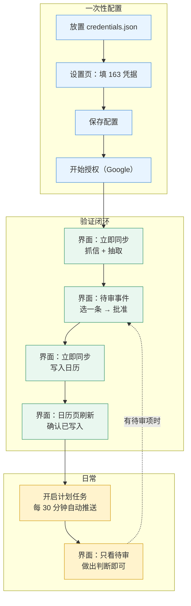
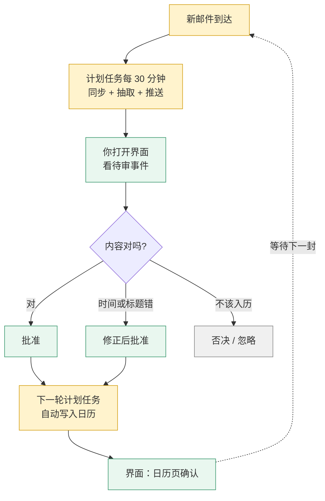

# 图形界面使用指南

> 给「双击运行、不碰命令行」的用法。
> 命令行见 [命令行与服务器使用指南](guide-cli.md)；内部设计见 [技术说明](guide-technical.md)。

双击 `auto-mail-gui.exe`（便携版）或运行 `python -m automail` 并设
`AUTOMAIL_GUI=1`（源码）。六个标签页：

| 页面 | 用途 |
|---|---|
| **总览** | 待审数量、配置状态、立即同步（带真实进度与**阶段级结果**）、暂停自动运行、快捷入口、日志 |
| **待审事件** | 批准/否决/忽略/修正/接管。冲突与「疑似重复」都标在行上；可按状态与最近天数筛 |
| **邮件** | 列表（全部/未读/有事件/抽取失败…）+ 详情（脱敏正文片段、抽出的事件、抽取依据）；**搜索边打字边过滤** |
| **日历** | 可调天数的未来窗口（默认 7 天，可设 1–365），可跳到 Google 日历 |
| **复盘** | 「很可能漏抽 / 值得留意 / 未判定」三类分组，即 `automail audit` 的可视化 |
| **设置** | 163 账号与授权码、LLM、Google 授权、策略、计划任务注册 |

### 几个通用操作

* **鼠标滚轮**：所有列表与设置页都支持（设置页内容较长，滚轮在这里最有用）。
* **上下键 / PageUp / PageDown**：列表里翻动；设置页也支持翻页键。
* **数字筛选框**：待审、邮件、日历、复盘页都有。既能从下拉里选预设，
  **也能直接输入数字**（如 45 天、6 小时）。超出范围会被夹到边界并回填显示。
* **搜索框**：输入即过滤（停手约 0.25 秒后生效），不必按回车；
  搜索覆盖**主题、发件人名称与邮箱地址**——列表里看得见的内容都能搜到。

## 操作指引

面向希望少碰命令行的使用者。

> **先做一次 Google 授权**（设置页 → Google 日历授权 → 「开始授权…」）。
> 没有授权时，「立即同步」里的推送阶段会**退回内存后端**：事件只在内存里存在，
> 进程退出即消失。程序会把这件事写在「本次运行」区与状态栏里
> ——**不会**把它报成成功。

界面的定位是**审批台兼执行台**：同步、抽取、看待审、**写入日历**都在界面里完成。

### 一次性配置

| 顺序 | 位置 | 操作 |
|---|---|---|
| 1 | 文件系统 | 把 Google 下载的 OAuth JSON 重命名为 `credentials.json`，放到程序目录（便携版）或项目根目录（源码运行） |
| 2 | 设置页 → 163 邮箱 | 填「邮箱账号」与「授权码」（16 位，**不是**登录密码） |
| 3 | 设置页 → 大模型（可选） | 填「接口地址」「API Key」「模型名」；留空则抽取降级为「仅规则 + ICS」，不会假装成功 |
| 4 | 设置页 | 点「保存配置」——凭据用 Windows DPAPI 加密写入 `data/secrets.dat`，`.env` 里的明文会被清空 |
| 5 | 设置页 → Google 日历授权 | 点「开始授权…」，会打开浏览器，需手动点「允许」 |
| 6 | 设置页（可选） | 点「注册计划任务」，之后每 30 分钟自动运行一次 |

> 第 5 步**必须**先完成第 1 步，否则授权会失败。若浏览器里登录了多个 Google
> 账号，用无痕窗口打开授权链接，避免选中未列入测试用户的那个账号。

### 用一封真实邮件走通闭环

配置完成后，先用**一封**邮件验证整条链路能通。全程在界面里完成：

具体操作顺序：

1. **总览 → 「立即同步」**，等进度条走完。这一步会抓取邮件、抽取出候选，
   并把**已批准**的事件写入日历。
2. 切到**「待审事件」**，「状态」筛选保持为「待审」。
3. **选中一条 → 点「批准」**。状态变为「已批准，等待写入日历」。
4. 回到**总览 → 再点一次「立即同步」**。审批与推送是分开的两步，
   所以批准之后要再跑一轮，推送阶段才会把它写进日历。
5. 切到**「日历」→「刷新」**，确认该事件出现在窗口里。默认看未来 7 天；
   活动在更远处就调大「未来 N 天」（可手输，1–365）。

**最容易卡住的就是第 4 步**：批准本身不写日历。每次运行结束后，看「本次运行」
区里**写入日历**那一行——它会显示新建/更新了几条；若显示「新建 0」而你有
待推送的事件，说明推送没成功，该行还会一并给出原因。

> 首次同步大邮箱时（数千封），界面上的「立即同步」**不带条数上限**，
> 一次性拉取过多可能触发 163 风控。建议先用命令行分批：
> `automail sync --apply --limit 200`，多跑几次，之后再用界面。

### 日常使用

走通之后，日常就只剩「看一眼、点一下」：

**注册计划任务后，「写入日历」是自动的**——计划任务走命令行入口
（`scripts/run.ps1` → `automail run --apply`），每 30 分钟自动推送。
你只需要在界面里做判断，最迟 30 分钟内会落进日历。

没开计划任务时，用界面手点也一样能写：**批准之后回总览再点一次「立即同步」**。

**「总览」页的「暂停自动运行」只挡计划任务**，不挡你手点的「立即同步」
——点它表示你现在就想跑一次同步与抽取。

### 每个状态词对应的动作

| 界面显示 | 含义 | 你该做什么 |
|---|---|---|
| 待审 | 抽取出候选，等你决定 | 批准 / 修正 / 否决 / 忽略 |
| 已批准，等待写入日历 | 你的决定已记录，但还没写进日历 | 总览点一次「立即同步」；注册了计划任务则最迟 30 分钟内自动完成 |
| 已写入日历 | 完成 | 无需动作，可在「日历」页跳转查看 |
| 写入失败 | 推送时网络或日历 API 出错 | **界面无法恢复**，用命令行 `automail events retry <id>` |
| 存在冲突 / 被外部修改 | 日历里的内容与记录不一致，程序已**停止写入** | 点「接管」以日历现状为准，或「否决」 |
| 日历中已不存在 | 该事件在 Google 侧被删除了（404） | **界面无法恢复**，用命令行 `automail events retry <id>` 重建 |

「待审事件」页的状态筛选有四个选项：**待审 / 已批准 / 需要关注 / 全部**。
「需要关注」是后四行的集合，日常扫一眼这个筛选就够。

> ⚠️ **上表最后两行目前是界面的盲区**（如实说明，非设计意图）。
> 界面**没有「重试」按钮**，而这两种状态只有 `retry` 能恢复，因此只能在
> 命令行执行 `automail events retry <id>`。
> 更要留意的是：这两种状态下点「批准」**不会报错，但也不会生效**——
> 后台会返回「跳过 1」，而界面不展示跳过原因。看到「成功 0」却没有解释时，
> 就是这个情况，请不要反复点击。
> 相比之下命令行会打印原因（`events approve` 会说明「当前为 push_failed
> 不允许 approve」），所以遇到卡住的事件时，命令行是更可靠的入口。

### 每个按钮做什么

| 按钮 | 作用 | 使用时机 |
|---|---|---|
| **批准** | 记录「同意写入日历」 | 内容正确时 |
| **修正…** | 改标题与开始时间，**改完即视为已批准** | 抽取的时间或标题不对时 |
| **否决** | 终态，不再提示 | 这件事不该进日历 |
| **忽略** | 终态，同一指纹不再入队 | 重复提醒、噪音通知 |
| **接管** | 以日历现状为新基线并解冻 | 仅冻结态（冲突 / 被外部修改）可用 |
| **详情** | 展开来源邮件、抽取依据、与日历的差异 | 拿不准该不该批准时 |

两点容易踩到的细节：

* **冻结态点「批准」不会生效**，界面会提示「需要先接管」。这是状态机不允许的
  转移，属于设计如此，不是故障。
* **「修正…」的时间格式**为 `YYYY-MM-DD HH:MM`，**留空表示不修改该项**。
  标题不能留空。修正走的是与命令行完全相同的解析逻辑，不存在两套格式。

### 其余三个页面

| 页面 | 什么时候看 |
|---|---|
| **邮件** | 想核对某封原始邮件时。搜索边打字边过滤（覆盖主题/发件人名/地址），可看脱敏正文片段、抽出了什么事件与依据；**这里不能审批**，只读 |
| **复盘** | 每周扫一次，确认没有「很可能漏抽」。它即 `automail audit` 的可视化 |
| **日历** | 写入后确认结果。窗口天数可调（默认 7 天）。选中已写入的事件可跳转到 Google 日历（未写入的事件无法跳转，会在提示里说明） |

### 已知偏差：界面不展示跳过原因

规格要求「审批时被跳过的事件必须报告原因」（`spec-event-state-machine.md`），
命令行的 `render_review_action` 确实会打印原因，但**界面只显示
「成功 N，跳过 M，未找到 K」的计数，不显示原因**（`gui/` 中没有任何代码
读取 `ReviewStats.reasons`）。

于是当某个操作对某条事件无效时（例如对 `push_failed` 点「批准」），
界面只会显示「成功 0」，使用者无从知道为什么。遇到这种情况请改用命令行，
它会说明原因。

### 几个刻意的设计

详见 [图形界面规格](spec-gui.md)。

* **批准不等于已写入日历**。`approve` 只记录你的决定，推送由 `push` 单独执行
  ——这样即使推送时断网，人的判断也不会丢。界面上显示「已批准，等待写入日历」。
  批准后回到总览再点一次「立即同步」即可推送。
* **每个阶段的结果都显示在「本次运行」区**。只有一个总结果时，「推送阶段抛异常」
  与「推送阶段没有可推的事件」在界面上完全一样——这正是过去那处静默失败的成因。
* **没写进真实日历就不会报成成功**。未授权时推送阶段会退回内存后端，界面会把
  这件事写出来（含原因），而不是显示「完成」。
* **被外部修改/冲突的事件要用「接管」，不能直接批准**（状态机不允许）。
  按钮给错会让人反复点击却毫无反应。
* **凭据用 Windows DPAPI 加密**存 `data/secrets.dat`，`.env` 里的明文会被迁移
  并清空。改造顺序是**先验证后擦除**：加密写完并回读校验通过才清明文，
  否则保留明文——宁可继续用明文，也不能两边都没有。
  （DPAPI 的边界：同用户态下任意进程都能解密，它防的是文件被拷走/同步。）
* **暂停自动运行只挡计划任务**，不挡界面上的「立即同步」——点它说明你现在
  就想跑一次，与"别在我不知情时自动跑"是两件事。
* **关窗时若任务在跑**，给「完成后退出 / 继续在后台」，**不提供强杀**：
  强杀会让运行锁滞留到超时（默认 30 分钟），期间计划任务全部报
  「已有运行在进行中」。

## 做不到的事（如实说明）

163 无法深链到具体邮件（网页 URL 是会话式的），
只能打开首页 + 提供「复制主题」；Google 日历链接按 `gcal_event_id` 尽力拼，
拼不出就退回日历首页。

* **界面不展示跳过原因**：遇到「操作了但没效果」时改用命令行，它会打印原因。

## 相关文档

* [便携版使用指南](portable-usage.md) —— 打包、放置、开机自启
* [命令行与服务器使用指南](guide-cli.md) —— 全部命令、退出码、定时运行
* [图形界面规格](spec-gui.md) —— 界面层的设计取舍（技术向）
* [返回 README](../README.md)
