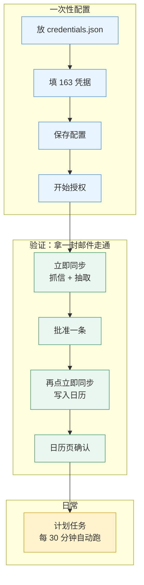

# 图形界面使用指南

双击 `auto-mail-gui.exe`。命令行见 [CLI 指南](guide-cli.md)，内部设计见 [技术说明](guide-technical.md)。

## 三步跑起来

1. **先授权**：设置页 → Google 日历授权 → 「开始授权…」→ 浏览器点「允许」
   （前置：`credentials.json` 已放在程序目录。缺它授权必失败）
2. **总览 → 「立即同步」**，等进度条走完
3. **待审事件 → 选一条 → 「批准」→ 回总览再点一次「立即同步」**

**第 3 步的两段式是最容易卡住的地方**：批准只记录你的决定，不写日历。
断网也不怕——批准已落库，下轮推送会补上。怎么看有没有写成：
「本次运行」区里**写入日历**那一行写着新建几条。

做第一次之前，用**一封**邮件验证闭环：

## 一次性配置

| # | 位置 | 做什么 |
|---|---|---|
| 1 | 文件系统 | `credentials.json` 放到程序目录 |
| 2 | 设置页 → 163 邮箱 | 填邮箱账号与**授权码**（16 位，不是登录密码） |
| 3 | 设置页 → 大模型 | 可选。留空则降级为「仅规则 + ICS」 |
| 4 | 设置页 | 点「保存配置」（凭据加密存 `data/secrets.dat`） |
| 5 | 设置页 → Google 授权 | 点「开始授权…」 |
| 6 | 设置页 | 可选：点「注册计划任务」，之后每 30 分钟自动跑 |

浏览器登录了多个 Google 账号时，用无痕窗口授权，否则可能选中未列入测试用户的那个。
一次性只能做一次，之后不再需要。

## 六个页面

| 页面 | 用途 |
|---|---|
| **总览** | 立即同步、本次运行结果、暂停自动运行、日志 |
| **待审事件** | 批准 / 修正 / 否决 / 忽略 / 接管 |
| **邮件** | 只读。核对原始邮件、看抽取依据。**不能审批** |
| **日历** | 看未来 N 天（N 可调，1–365）。改天数即时重画，不重新联网 |
| **复盘** | 每周扫一次，看有没有「很可能漏抽」 |
| **设置** | 凭据、策略、计划任务 |

常用操作：**滚轮**所有页面可用；**数字框**可直接输入（如 45 天）；
**搜索框**输入即过滤，覆盖主题、发件人名与邮箱地址。

## 状态词 → 你该做什么

| 界面显示 | 你该做什么 |
|---|---|
| 待审 | 批准 / 修正 / 否决 / 忽略 |
| 已批准，等待写入日历 | 回总览点一次「立即同步」 |
| 已写入日历 | 没事了 |
| 存在冲突 / 被外部修改 | 点「接管」，或「否决」 |
| 写入失败 | 界面修不了 → `automail events retry <id>` |
| 日历中已不存在 | 界面修不了 → `automail events retry <id>` |

「待审事件」页的状态筛选：**待审 / 已批准 / 需要关注 / 全部**。日常只看「需要关注」。

## 按钮

| 按钮 | 作用 |
|---|---|
| **批准** | 同意写入日历 |
| **修正…** | 改标题/时间，**改完即视为已批准**。格式 `YYYY-MM-DD HH:MM`，时间留空=不改，标题不能空 |
| **否决** | 终态，不再提示 |
| **忽略** | 终态，同指纹不再入队 |
| **接管** | 仅冻结态可用。以日历现状为准并解冻 |
| **详情** | 展开来源邮件、抽取依据、与日历的差异 |

## 卡住了？

| 症状 | 原因 | 解决 |
|---|---|---|
| 批准后日历里没有 | 批准≠写入 | 回总览再点一次「立即同步」 |
| 点操作没反应，显示「成功 0」 | 该状态不允许这个动作 | 改用命令行，它会打印原因 |
| 提示「需要先接管」 | 冻结态不能批准（设计如此） | 点「接管」 |
| 提示「本轮未写入真实日历」 | 未授权，退回内存后端（进程退出即消失） | 设置页完成授权 |
| 首次同步卡很久 | 界面同步不带条数上限 | `automail sync --apply --limit 200` 分批跑 |

**界面不展示跳过原因**（已知偏差）：界面只显示「成功 N，跳过 M」的计数。
遇到「操作了但没效果」就用命令行重做，原因会打出来。

## 做不到的事

* 163 无法深链到具体邮件 → 只能打开首页，请用「复制主题」自行搜索
* 未写入日历的事件无法跳转到 Google 日历
* 界面没有「重试」按钮 → 失败事件要用 `automail events retry`

## 相关文档

* [CLI 指南](guide-cli.md) —— 全部命令、凭据获取、定时运行
* [便携版指南](portable-usage.md) —— 打包、放置、开机自启
* [图形界面规格](spec-gui.md) —— 界面层设计取舍（技术向）
* [返回 README](../README.md)
