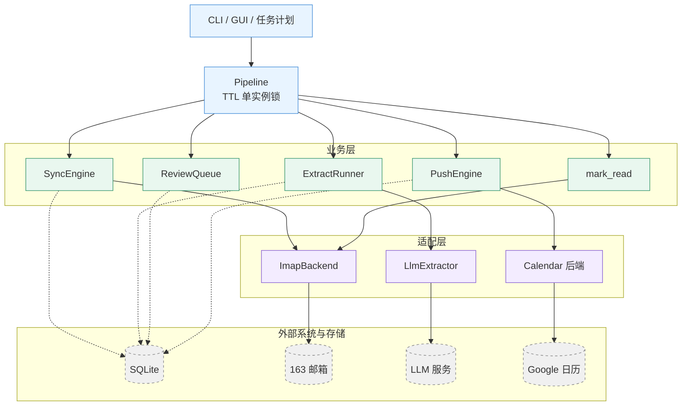
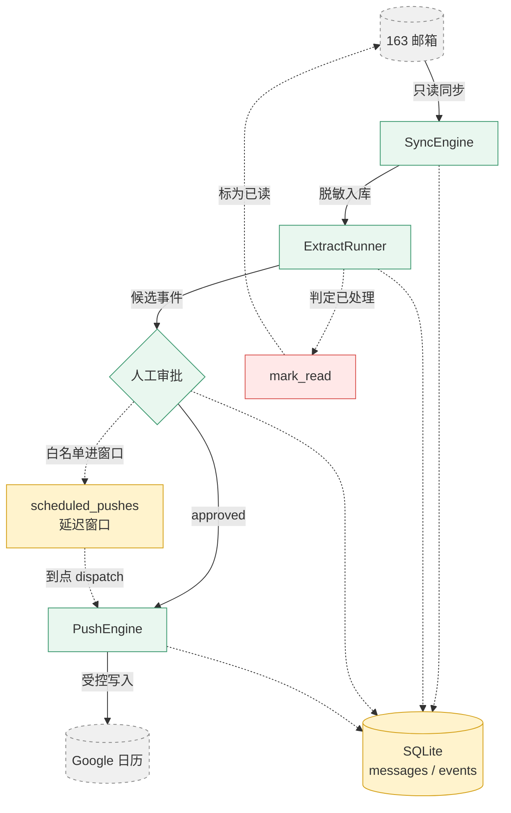
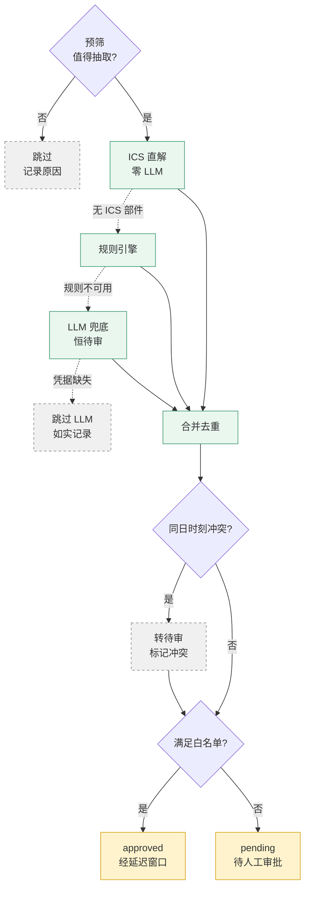
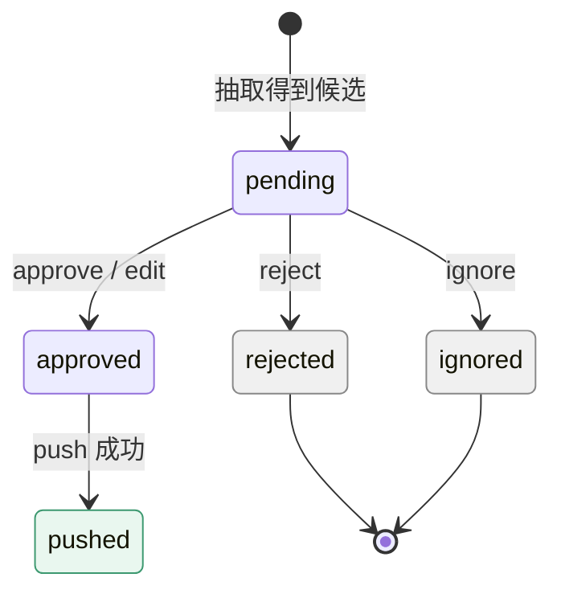
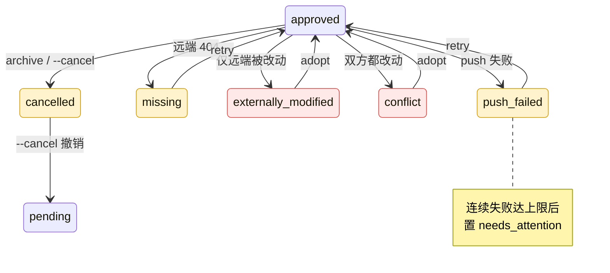
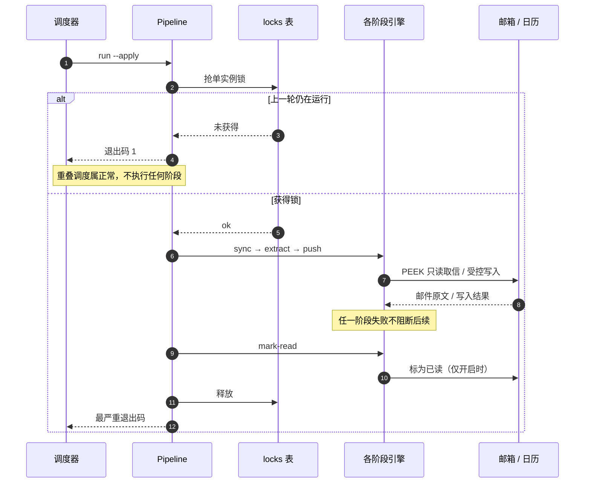
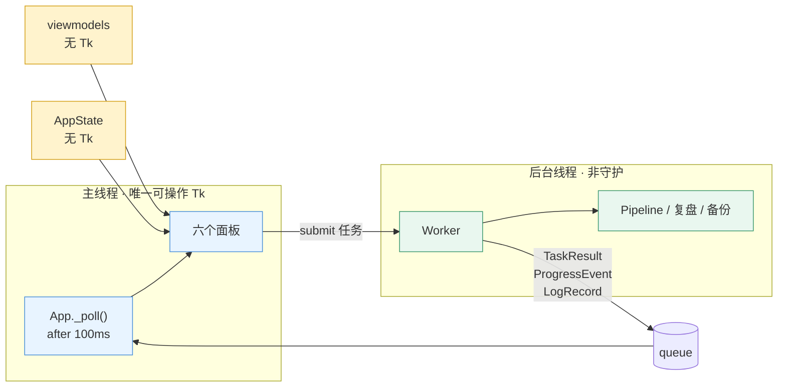

# 技术说明

> 给想了解内部设计的读者（也适合作为改代码前的导览）。
> 只是使用的话：[图形界面使用指南](guide-gui.md) / [命令行与服务器使用指南](guide-cli.md)。

本文覆盖架构分层、数据流、抽取与状态机、并发安全、设计取舍与已知限制。
文末列出对应的完整设计规格。

## 系统架构

五层结构：**入口层**驱动**编排层**，编排层调度**业务层**，业务层只通过
**适配层**访问外部系统，全部状态落在一个 SQLite 里。



实线是「调用」，虚线是「读写本地状态」。每个业务模块只经由一个适配层实现
触达外部系统（例如只有 `PushEngine` 会碰日历），因此后端可以整体替换成
`FakeCalendar` 做演练。

`threads` / `digest` / `audit` / `stats` 是只读旁路工具（读库、写本地文件），
不参与主链路，故未画出。
> 两张图都做了精简：`Windows 任务计划` 与 `GUI Worker` 只是入口层/编排层的另外两种驱动
> 方式（前者走 `scripts/run.ps1` 调同一个 CLI，后者是 GUI 的后台线程），`MIME 解析`
> 是 `SyncEngine` 内部的一步而非独立依赖，`threads / digest / audit / stats` 是旁路工具
> 且不参与主链路——它们的细节见下方职责表与目录结构。

### 分层职责

| 层 | 主要模块 | 职责 | 刻意不做的事 |
|---|---|---|---|
| 入口层 | `cli.py` / `gui/` / `scripts/*.ps1` | 参数解析、渲染、把动作翻译成一次调用 | 不含业务规则 |
| 编排层 | `pipeline.py` | 阶段顺序、单实例锁、退出码取最严重 | 不解析邮件、不构造日历 payload |
| 业务层 | `mail/sync.py`、`extract/`、`review.py`、`push.py`、`read_state.py`、`threads.py`、`digest.py`、`audit.py` | 领域逻辑与状态机 | 不直接碰 IMAP / Google SDK |
| 适配层 | `mail/imap_backend.py`、`mail/mime.py`、`extract/llm.py`、`calendar/` | 协议实现，可替换（真实 ↔ Fake） | 不决定「该不该写」 |
| 存储层 | `db.py`（基础设施）、`store.py`（邮件域仓库）、`migrations/` | 连接、PRAGMA、迁移、备份、锁、运行记录 | 不含业务判断 |

> 为什么把 `db.py` 与 `store.py` 分开：前者是**基础设施**（连接/迁移/备份/锁/
> 运行记录），后者是**邮件领域的读写**。混在一起会让 db 无限膨胀，且基础设施的
> 读者被迫面对邮件字段细节。

### 目录结构

```
src/automail/
├── cli.py                 命令行入口（typer 应用，全部子命令）
├── __main__.py            可执行入口：python -m automail 与打包 exe 共用
├── gui_main.py            窗口化入口（--selftest 供构建脚本自检）
├── pipeline.py            主流程编排：锁 + 阶段序列 + 退出码
│
├── db.py                  SQLite 基础设施：连接/PRAGMA/迁移/备份/锁/runs
├── store.py               邮件域仓库：messages / processed_mail / sync_state / senders
├── models.py              状态枚举与轻量 dataclass（状态的单一事实来源）
├── settings.py            配置层：.env / 环境变量 → Settings
├── migrations/            001_initial … 004_messages_marked_read（前向迁移）
│
├── mail/                  IMAP 后端、MIME 解析与清洗、头部解码、增量同步
├── extract/               预筛器 / ICS 直解 / 规则引擎 / LLM 抽取 / 流水线 / 离线评测
├── calendar/              CalendarBackend 协议、GCal 实现、Fake、OAuth、规范化、所有权
│                          factory.py：后端选择（CLI 与 GUI 共用同一份判定）
│
├── review.py              审核队列：审批、修正、接管、重试、延迟推送窗口
├── push.py                推送引擎：受控写入、幂等反查、三方比对、归档/删除
├── read_state.py          已读回写（本项目唯一的邮箱写操作）
├── audit.py               抽取复盘：最近哪些邮件可能没抽对（只读）
├── threads.py             线程重建（163 无服务端 THREAD）
├── digest.py              每日摘要（Markdown，落 out/）
├── stats.py               只读统计
├── doctor.py              自检（离线 / --live 联网）
├── backup / pause / portable / secrets_store / envfile / logging_setup / sanitize …
└── gui/                   窗口层（唯一碰 Tk 的地方）+ state/worker/viewmodels（可单测）

tests/                     全程离线、不碰真实凭据；fake_imap.py 起真实 TCP 假服务器
docs/                      spec-*.md 设计规格、eval-*.md 评测报告、portable-usage.md
scripts/                   任务计划安装 / 构建 / 运行包装
```

## 数据流

一封邮件从信箱到日历，要经过同步、抽取、人工审批（或白名单直通）、受控写入
四道关口。**写邮箱和写日历是两个方向的尽头**，中间全部是可回滚的本地状态。



实线是**主链路**，虚线是**反馈与旁路**。为控制在可读的尺寸内，两处细节移到这里
（图示已按 skill 的「宁可丢进正文，不要塞进图里」处理）：

* **同步取信的确切方式**是 `EXAMINE`（只读选中）+ `BODY.PEEK[]`（不置已读标志），
  全程不发任何 STORE；这是「邮箱默认只读」的实现基础。
* **`events.status` 的中间态**（`pending` / `approved` / `pushed` / `push_failed` / 冻结态…）
  都落在同一个 `events` 表里，上图合并为 `DB` 一个节点；完整转移见下方状态机。
* **旁路工具**（`audit` → `out/` 报告、`digest` 摘要、`threads` 线程重建）不参与主链路，
  只读库并写本地文件，故未画出。

读这张图的三个要点：

* **`push` 是唯一的日历写入口**，且只处理 `approved`；`pending` 永不写入。
* **`mark_read` 是唯一的邮箱写入口**，默认关闭，且只改 `\Seen` 一个标志。
* 虚线是**反馈/派生**路径：`scheduled_pushes` 只是调度队列（不属于事件状态机），
  从日历回写的哈希用于下一轮检测用户手改。

### 抽取分层（ICS → 规则 → LLM）

抽取按成本和可信度从高到低分层：**能确定解的绝不去问 LLM，能便宜的绝不去问贵的**。



ICS / 规则 / LLM 三者是**降级关系**（虚线：上一级拿不到结果才走下一级），
但三者的产出都会进入合并去重——ICS 与规则可以同时命中同一封邮件。

白名单（可直接 `approved`）只有两条，其余一律 `pending`：

1. `source=ics` 且 `METHOD:REQUEST` 且 `organizer` 非空、起止可解析、时间在未来、
   发件人是联系人；
2. `source=rules` 且 `confidence > 0.85`（**严格大于**，实际只有 0.95 档可过）。

**全部 `source=llm` 恒进待审**——误写日历的代价高于漏识别。

### 事件状态机

`events.status` 是唯一状态源；`scheduled_pushes.state` 只是调度队列，不属于本状态机。

状态机按「正常路径」与「异常/冻结路径」拆成两张，因为 12 个状态放进一张图后
会宽到无法阅读。

**正常路径与终态**：



**异常与冻结路径**（全部从 `approved` / `pushed` 出发，且大多能回到 `approved`）：



`pushed` 上还挂着三条同类转移（检测到手改 → `externally_modified`、双方都改 →
`conflict`、`archive` → `cancelled`），与上图 `approved` 出发的三条完全对应，
故未重复画出。

**冻结态**（`externally_modified`、`conflict`）禁止任何 update/delete。
唯一的出路是 `adopt`（以当前远端为新基线，承认用户的改动，回到 `approved`）。
`reject` / `ignore` / `approve` 三个动作**都只允许从 `pending` 出发**
（`_ALLOWED_*_FROM = {pending}`）——事件一旦离开待审就不该被当作待审项撤销，
否则「已批准的事件被一个误触的 reject 静默抹掉」是可能的。

`--cancel` 后回到 **`pending`** 而不是 `approved`：撤销意味着用户收回了自动推送的
授权，回到 `approved` 会被自动流程再次消费，等于撤销无效。

#### 已定义但当前无代码路径产生的状态

如实标注，避免读者以为这些状态在运行中真会出现：

| 状态 | 规格中的含义 | 现状 |
|---|---|---|
| `uncertain` | 反查 Google 时请求本身报错，无法判定远端是否已有该事件 | 在枚举、CHECK 约束与 `retry`/`digest` 的过滤条件里都支持，但**没有任何代码路径写入它**——反查失败目前被当作 `push_failed` 处理 |
| `superseded` | 被同 `ics_uid` 的更高 `SEQUENCE` 取代 | 已列入终态集合，但 v1 不展开 `RRULE`、未实现 SEQUENCE 比较，因此不会被写入 |

两者都是在为后续版本预留的槽位：库结构与过滤逻辑已经就位，接入时不需要迁移。

### 一次 `run` 的执行与并发安全

`automail run` 由 Windows 任务计划每 30 分钟触发一次，因此**必须假设会重叠**。



四个阶段各自与外部系统的具体调用（同步用 `EXAMINE` + `BODY.PEEK`、
推送先按 `auto_mail_key` 反查再写入等）在上文的架构图与数据流图里已标注；
时序图这里合并为「各阶段引擎」以保证可读性。

两层防线，缺一不可：

| 层 | 机制 | 作用 |
|---|---|---|
| 第一层 | `locks` 表 + `owner_run_id` + TTL 抢占 | **减少无谓工作**（少连一次邮箱、少一次日历调用） |
| 第二层 | 同步游标 / 抽取唯一索引 / 推送幂等反查 / 摘要同日覆盖 | **保证正确性**——锁失效时也不会产生重复 |

**锁不是正确性的单点依赖**：锁只覆盖单次 `Pipeline.run()`，第二个进程可能在第一个
释放锁后才拿到。此时靠下层的幂等性顶住（测试用例
`test_idempotency_holds_when_runs_overlap` 专门覆盖这条路径）。

用数据库锁而非文件锁的原因：崩溃残留的锁会在 TTL 后**自动失效**，不需要人工清理；
文件锁的残留会永久阻塞。

### 三层账本与幂等键

同一个「进度」被刻意拆成三个互不重叠的账本，避免出现两套平行账本互相打脸：

| 账本 | 字段 | 只回答 |
|---|---|---|
| sync 层 | `processed_mail.status` | 这封邮件**是否已抓取入库** |
| extract 层 | `messages.extract_status` | 抽取**进行到哪一步** |
| 预算层 | `messages.extract_attempts` | 这封邮件**被 LLM 尝试过几次**（防毒邮件持续烧钱） |

各层的幂等键：

| 层 | 幂等键 | 重复执行的后果 |
|---|---|---|
| 同步 | `UNIQUE(account, folder, uid_validity, uid)` + `highest_uid` 游标 | 不重复入库 |
| 抽取 | `UNIQUE(message_id, fingerprint)` | 不重复产出候选 |
| 推送 | create 前按 `auto_mail_key` 反查，命中则回填 | 日历里不会出现重复事件 |
| 摘要 | 文件名 `digest-YYYY-MM-DD.md`（按本地日期） | 同日覆盖同一个文件 |

## GUI 线程模型

界面层严格分成两半，**只有窗口层能碰 Tk**：



三条实现约束（都有具体理由，不是风格偏好）：

1. **后台线程只往队列里放事件，主线程用 `after()` 取。** Tk 不是线程安全的，
   从工作线程直接改控件会随机崩溃。
2. **线程是非守护的。** 守护线程会在主线程退出时被直接杀掉，可能留下半成品事务与
   **未释放的运行锁**（锁在 `finally` 里释放，被强杀就释放不了）。
3. **配置保存后重建依赖对象。** `Pipeline` 在构造时就绑定了 settings，
   不重建会出现「设置已保存但不生效」。

## 抽取质量（实测）

| 指标 | 合成语料（17 封） | 真实邮件（89 封 + 1 封未来事件样本） |
|---|---|---|
| 召回率 | 100% | 未来事件样本 **3/3 命中**；整体召回率未验证 |
| 精确率 | 100% | — |
| **自动入历准确率**（最关键） | 100% | **100%**（0 个错误写入） |
| 预筛过滤率 | — | 52%（46/89 封） |

首批 89 封真实邮件里**没有一个未来的事件**（那批邮件最晚 8 月下旬收到，内容全已
过期），因此只能证明「不会做出危险动作」。这个缺口后来由一封真实的**未来事件
邀请函**补上——三个真值事件全部命中，时间与标题都正确，同时暴露并修复了 8 个缺陷。
详见 [真实数据验证](eval-real-data.md)。

整体召回率仍**未验证**：单个（且是自己转发进来的）样本不足以支撑这个数字。
详见 [合成语料评测](eval-report.md)。

## 设计原则（为什么这样做）

完整规格见 [`docs/`](./)：

* [事件状态与审批规则](spec-event-state-machine.md)
* [IMAP 同步一致性与 UIDVALIDITY 处理](spec-imap-sync.md)
* [MIME 解析与正文清洗](spec-mime-cleaning.md)
* [线程重建与摘要](spec-threads-digest.md)
* [主流程编排与并发安全](spec-pipeline-concurrency.md)
* [Google 事件所有权、更新与删除策略](spec-gcal-ownership.md)
* [退订与归档的逐项确认与失败恢复](spec-unsubscribe-archive.md)
* [图形界面规格](spec-gui.md)
* [已读回写规格](spec-mark-read.md)

几条关键取舍：

* **只有 ICS 与高置信规则能自动入历**，LLM 结果一律待审——
  误写日历的代价高于漏识别。
* **邮件正文视为不可信数据**：其中的任何指令都不会改变程序行为，
  写操作只由 CLI 参数、审批状态机与配置驱动（防 prompt injection）。
* **只动自己创建的事件**（带 `auto_mail_key` 标记），
  检测到用户手改则冻结，需显式 `adopt` 才恢复接管。
* **本地只存脱敏正文片段** + 全文哈希，需要时可回 IMAP 重新取信。
* **宁可漏报，不可误报**：复盘工具与冲突判定一致采用保守取向——
  不确定的一律交给人看，而不是猜一个答案。
* **失败必须说明为什么失败**：文件夹级失败带有 `error` 字段，
  而不是只留下一行零值统计。

### 为什么不能用 etag 做条件请求

Google Calendar API v3 **未定义** `If-Match`（已核对官方 discovery 文档）。
因此推送更新走「get → 比对 → update」的乐观流程，接受一个极小的竞态窗口；
真正兜底的是三方哈希比对与幂等反查，而不是条件请求。

## 隐私与安全

以下文件**禁止入库**（已在 `.gitignore` 中）：

```
.env  credentials.json  token.json
data/  *.db  *.db.bak  out/  logs/
tests/fixtures/*.eml      # 测试样本可能含真实邮件
.zcode/                   # 开发过程产物（AI 会话计划草稿）
```

* 摘要与日志默认只记**元数据**（UID / 主题 / 发件人）；
* 异常栈与 `runs.error` **不写邮件正文**，且会剥离控制字符（防终端注入）；
* 数据库备份自动按数量与年龄清理（`DB_BACKUP_KEEP` / `DB_BACKUP_MAX_AGE_DAYS`）；
* 备份与数据库应放在**不受云盘同步的目录**，README 无法替你保证这一点。

### 关于评测文档中的真实数据

`eval-real-*.md` 与相关测试来自真实邮箱与真实日历的验证。为使其可公开，
其中的**机构名、场地名与个人身份信息已替换为泛称**（例如「某大学的邀请函」），
但日期、中文数字写法、排版结构、缺陷分析与判定结果**全部保留原样**——
这些才是报告的技术价值所在，替换泛称不影响任何结论的可复核性。

**已知限制**：本项目**不做数据库加密**。Windows 无法照搬 Unix 的 `chmod`
权限模型，请自行确保 `data/` 目录的访问权限。凭据本身用 Windows DPAPI 加密，
但 DPAPI 只防「文件被拷走/同步」，同用户态下的任意进程仍可解密。

## 已知限制（163 服务端行为）

这些不是本项目能"修好"的问题，而是需要在设计上容纳的现实：

* **无 IDLE**：163 不支持推送，只能轮询，因此同步不是实时的。
  间隔不要低于 15 分钟，否则容易触发风控。
* **无服务端 THREAD**：线程只能在客户端重建（不依赖服务端扩展）。
* **需发送 IMAP `ID`**：认证后不发 `ID` 会被 `SELECT` 拒绝并报
  `Unsafe Login`。程序会自动发送，遇到拒绝时记录原始响应、重发 ID 再重连，
  **不会**把它误判成授权码错误。
* **禁用 SASL-IR**：163 使用的 Coremail 会先声明 `SASL-IR` 能力再拒绝
  inline 形式。程序走明文 `LOGIN`，天然规避。若你改了这块代码，请注意别踩回去。
* **风控会静默阻断**：可能收到「阻止了一次不安全的收信请求」告警邮件。
  程序采用单连接、指数退避（1→2→4→…→30 分钟）来降低概率。
* **RFC 3501 §6.4.8 的 `n:*` 语义**：`559:*` 始终包含最后一封邮件，即使 559
  高于任何已分配 UID。因此增量搜索前必须先过 **UIDNEXT 预判门**，否则追平后会
  反复重取最后一封。
* **v1 不展开 `RRULE`**：重复事件按单次写入，标题加「(重复)」，描述保留原
  RRULE。不承诺完整重复事件管理、RSVP 跟踪、与会者同步。

## 已知实现偏差（待修）

上节是无法绕开的外部现实；这里是**本项目自身的实现问题**，会随版本修复。
两条都经由代码核对与实测复现确认，不是推断：

| 偏差 | 影响 | 当前应对 |
|---|---|---|
| `push_failed` 不会自动重试 | 推送失败的事件永久停在失败态，与注释/规格的「按退避重试」不符 | `automail events retry <id>` |
| 界面不展示跳过原因 | 操作无效时只显示「成功 0」，无解释 | 改用命令行，它会打印原因 |

两者的共同点是**静默**：界面都显示成功或完成，问题只体现在「事情没发生」。
遇到「操作了但没效果」时，第一时间用命令行重做一次，命令行会把原因打出来。

### 已修复：界面「立即同步」不写日历

这曾是三条偏差里最严重的一条——它同时踩中「没传日历后端」与「界面不读阶段结果」，
于是点了「立即同步」之后，同步与抽取都真做了、日历里却什么都没有，
而界面显示的是一个干净的「完成」。

现在「立即同步」走 `AppState.run_pipeline()`：它选择日历后端、**把后端传进
`Pipeline`**，并把阶段级结果交回总览页的「本次运行」区。另外两处：

* **没写进真实日历就不会报成成功**。未授权时推送会退回内存后端，界面明说原委
  （含「缺少 credentials.json」这类具体原因），而不是显示「完成」。
* **运行只写一条**：界面触发的轮次也记进 `runs`（命令名为「run（界面）」），
  阶段失败写进 `runs.error`，关掉窗口后仍可回查。

顺带修掉两个连带缺陷：`recent_runs` 读错了字段名（`r.id` 应为 `run_id`），
导致「最近运行」永远空白且不报错；阶段说明在同时有统计与错误时会丢掉错误。

详见 [图形界面规格 §16](spec-gui.md)。

## 开发

```bash
.venv/Scripts/python.exe -m pytest tests/ -q     # 运行测试
.venv/Scripts/python.exe -m ruff check src tests # 静态检查
.venv/Scripts/python.exe -m automail.gui_main --selftest   # 界面自检
```

测试全程**不联网、不触碰真实凭据**。IMAP 用 `tests/fake_imap.py` 起一个
**真实的 TCP 假服务器**，让 `imapclient` 走完整协议往返，因此能卡住真实行为
（而不只是"我们调用了什么方法"）：

* 断言必须出现 `BODY.PEEK[]`，出现 `BODY[]` 会让用户邮件变成已读；
* 断言认证后确实发送了 `ID`；
* 断言遇到 `Unsafe Login` 会重发 ID 并重试；
* 复现 RFC 3501 §6.4.8 的 `n:*` 边界（`3:*` 在最大 UID 为 1 时仍返回 1），
  以此证明 UIDNEXT 预判门是必要的。

界面层同样可分测：`gui/state.py`、`gui/worker.py`、`gui/viewmodels.py`
**不含 Tk 代码**，可在 headless 环境下用普通单测覆盖「刷新拿到了什么、
配置重载后哪些对象被重建」这类最容易出错的行为。

### 数据库迁移

前向迁移（forward-only），迁移文件一旦发布**不再修改**，只能新增。
用 `PRAGMA user_version` 作为水位线，升级前自动备份（仅在有数据时）。

| 版本 | 内容 |
|---|---|
| 001 | 初始 schema（messages / events / threads / processed_mail / sync_state / senders / runs / locks / app_meta / todos / unsubscribe_log） |
| 002 | `events.manual_edited` —— 整行级「用户改过」标志 |
| 003 | `events.snapshot_payload` —— 让冻结时的差异展示有意义 |
| 004 | `messages.marked_read_at` —— 可审计、可回退的已读回写痕迹 |

## 路线图

| 阶段 | 内容 |
|---|---|
| **P0** ✅ | 配置、数据库与迁移、CLI、日志、运行记录、离线 doctor |
| **P1** ✅ | MIME 清洗 + 只读 IMAP 同步（UIDNEXT 预判门、分层台账、reactivate、移动检测、补偿扫描、分批限流） |
| **P2** ✅ | 规则 / ICS / LLM 抽取 + 预筛器 + 离线评测（真实数据暴露「时间已过」缺陷并修复） |
| **P3** ✅ | 审核队列（原子领取+僵尸回收）、FakeCalendar、规范化三方比对、受控写入（幂等反查/冻结/归档）、延迟窗口 |
| **P4** ✅ | Google OAuth 授权 + 真实 Calendar 后端（写入/幂等反查/哈希稳定/归档均已在真实 API 上验证） |
| **P5** ✅ | 线程重建（幽灵节点/无 ID 兜底/弱关联排除自动化通知）、每日摘要、只读统计 |
| **P6** ✅ | 主流程编排（阶段互不阻塞 + TTL 单实例锁 + 幂等纵深防御）、任务计划安装脚本、备份命令 |
| v2 | 待办与提醒、需回复追踪、订阅清理与退订 |

> P6 之后修掉了图形界面「立即同步」不写日历的缺陷（界面与命令行现在共用
> `calendar/factory.py` 的后端选择，阶段结果也显示在界面里）。

## 相关文档

* 完整设计规格：[事件状态机](spec-event-state-machine.md)、
  [IMAP 同步一致性](spec-imap-sync.md)、
  [MIME 解析与清洗](spec-mime-cleaning.md)、
  [线程与摘要](spec-threads-digest.md)、
  [主流程编排与并发安全](spec-pipeline-concurrency.md)、
  [Google 事件所有权](spec-gcal-ownership.md)、
  [退订与归档](spec-unsubscribe-archive.md)、
  [图形界面](spec-gui.md)、
  [已读回写](spec-mark-read.md)
* 评测报告：[合成语料](eval-report.md)、
  [真实数据](eval-real-data.md)、[真实日历](eval-real-gcal.md)
* [便携版使用指南](portable-usage.md)
* [返回 README](../README.md)
